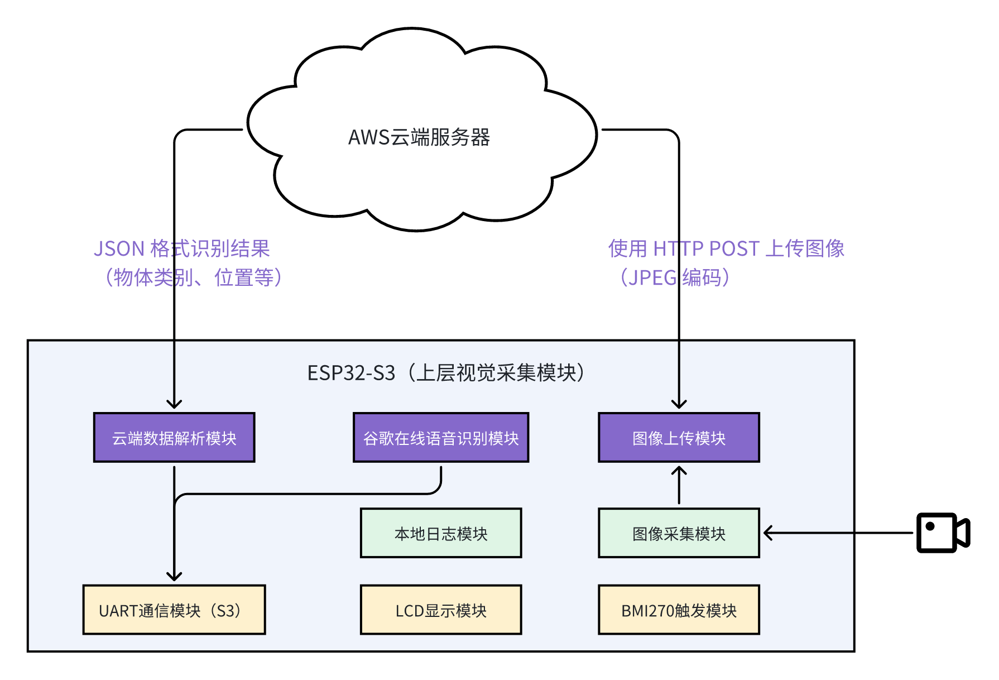
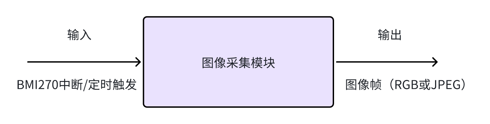
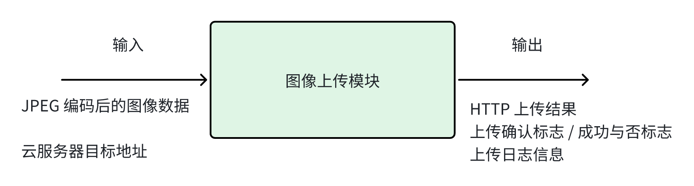
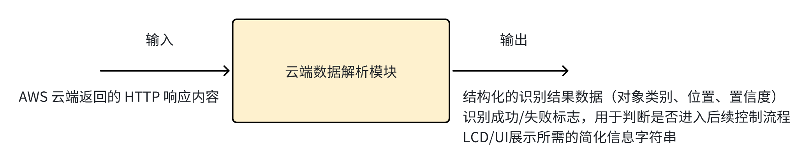
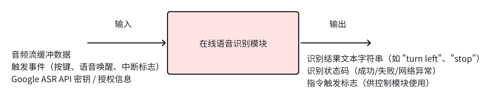
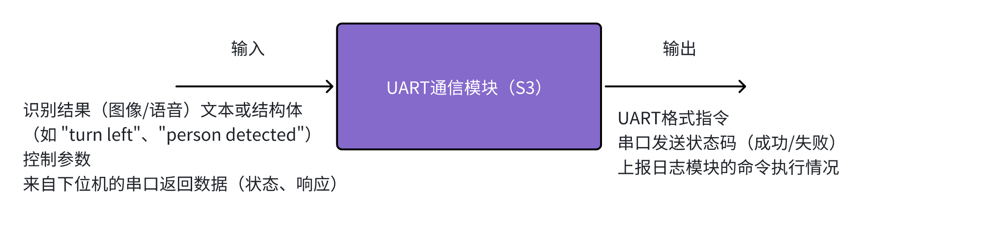
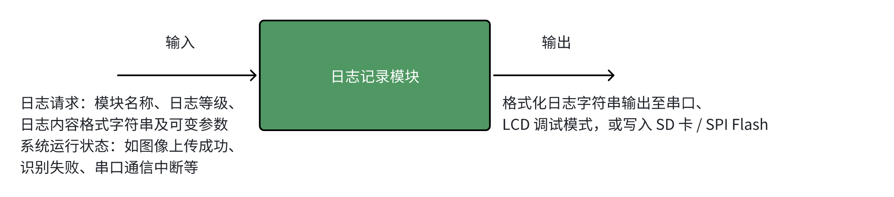

## 上层子系统功能模块（ESP32-S3）

## 1 总体设计概述

### 1.1 系统组成与功能概述

​	本系统基于 ESP32-S3 实现上层视觉采集与远程智能识别控制功能，系统主要由本地边缘采集模块与云端识别模块组成，如图所示。ESP32-S3 端主要包含 8 个功能模块：图像采集模块、图像上传模块、云端数据解析模块、在线语音识别模块、UART 通信模块、LCD 显示模块、BMI270 触发模块及本地日志模块。



其中：

- **图像采集模块** 通过摄像头实时采集图像，在 **BMI270 模块触发下启动采集流程**；

- **图像上传模块** 对采集结果进行编码并通过 **HTTP POST 上传至 AWS 云端**；

- 云端识别服务完成图像推理后返回 **JSON 格式的识别结果**（类别、位置信息等）；

- **云端数据解析模块** 对 JSON 结果解析，并通过 **UART 控制模块**发送控制指令；

- 同时，系统内嵌有 **在线语音识别模块**，支持调用 Google API 实时解析用户语音命令；

- 所有运行结果通过 **LCD 显示模块进行反馈**，并由 **日志模块进行本地记录**。

### 1.2 模块划分与职责说明

#### 1.2.1 模块划分原则

​	本系统采用功能解耦 + 数据流驱动的模块划分方式，基于输入/输出通道、处理职责与触发机制将 ESP32-S3 内部逻辑功能划分为多个相互独立的模块。每个模块负责一项核心处理功能，并通过消息队列、中断触发或事件组等机制进行协同工作。该模块化设计便于任务管理、功能扩展及后期调试维护。

#### 1.2.2 模块划分清单与职责说明

| 模块名称            | 模块类型     | 职责说明                                                     |
| ------------------- | ------------ | ------------------------------------------------------------ |
| 图像采集模块        | 输入处理模块 | 通过摄像头采集图像帧，受 BMI270 触发或定时器调度驱动         |
| 图像上传模块        | 网络通信模块 | 将图像帧通过 HTTP POST 上传至云端，提供上传状态反馈          |
| 云端数据解析模块    | 数据解析模块 | 对 AWS 返回的 JSON 格式识别结果进行解析，提取类别与位置等字段 |
| 在线语音识别模块    | 外部服务模块 | 使用 Google API 实现语音命令识别，转换为文本结果             |
| UART 通信模块（S3） | 控制输出模块 | 将识别结果或控制指令通过串口发送给下位机，支持命令格式封装   |
| LCD 显示模块        | 用户反馈模块 | 实时显示识别状态、执行结果或调试信息，支持图形化显示         |
| 本地日志模块        | 后台服务模块 | 记录系统事件与状态变更日志，支持输出到串口或 Flash           |
| BMI270 触发模块     | 硬件触发模块 | 检测运动或姿态变化，作为图像采集/语音识别等操作的启动信号来源 |

### 1.3 系统设计原则与架构策略

​	本系统基于 ESP32-S3 平台构建，面向“视觉采集 + 云端识别 + 本地控制反馈”的典型嵌入式智能应用场景。系统在架构设计过程中，结合 MCU 的资源特点与多源输入协同的任务需求，遵循如下设计原则与架构策略：

#### 1.3.1 系统设计原则

（1）**功能模块化**

系统采用功能解耦设计，将整体功能划分为图像采集、图像上传、云端解析、语音识别、控制输出、用户交互、日志记录等独立模块。每个模块职责单一、边界清晰，便于独立测试与后期维护。

（2）**任务并发与事件驱动结合**

系统基于 FreeRTOS 构建多任务协同机制，任务间通过队列、事件组等方式异步通信。在外设触发（如 BMI270）与云服务响应的驱动下，各模块按事件响应机制调度执行，保证系统实时性与响应效率。

（3）**云边协同智能处理**

系统利用本地 MCU 进行数据采集与前处理，将图像与语音上传至云端（AWS / Google）执行计算密集型推理任务。ESP32-S3 仅负责结果解析与控制逻辑，实现“边缘采集 + 云端推理 + 本地执行”的资源最优化设计。

（4）**调试友好与部署可切换**

系统支持运行模式切换，在调试模式下启用详细日志输出、LCD 调试显示、任务状态观测；在部署模式下关闭非核心日志，提升性能与节能表现。

#### 1.3.2 系统架构策略

（1）功能层级结构划分

系统采用“输入 → 处理 → 输出”三阶段功能划分：

| 层级   | 模块组成                                   |
| ------ | ------------------------------------------ |
| 输入层 | 图像采集模块、BMI270触发模块、语音采集模块 |
| 处理层 | 图像上传模块、云端解析模块、语音识别模块   |
| 输出层 | UART通信模块、LCD显示模块、日志记录模块    |

这种结构确保系统运行流程清晰、模块职责明确，便于调度与调试。

（2）通信机制统一抽象

系统统一采用 FreeRTOS 提供的机制进行模块间通信：

| 类型                     | 用途示例                       |
| ------------------------ | ------------------------------ |
| 消息队列（Queue）        | 图像帧传输、识别结果传递       |
| 事件标志组（EventGroup） | 云端响应完成通知、触发事件广播 |
| 信号量 / 互斥锁          | 配置访问保护、LCD共享访问控制  |

这种抽象方式使通信机制稳定可靠，接口一致性强，易于扩展和替换。

（3）**面向对象式三层架构设计（App / Middleware / Driver）**

为增强系统工程化程度与可维护性，系统在软件结构上引入分层架构，具体分为：

| 层级                       | 说明                                                         |
| -------------------------- | ------------------------------------------------------------ |
| **应用层（App）**          | 各功能任务的逻辑实现与任务调度，例如 task_camera、task_upload 等 |
| **中间件层（Middleware）** | 云服务通信接口、图像编码、协议封装等功能组件，如 aws_upload、google_asr |
| **驱动层（Driver）**       | 访问外设的硬件接口封装，如 camera.c、lcd.c、bmi270.c、uart.c 等 |

通过分层设计，系统实现了“功能逻辑 ↔ 协议服务 ↔ 硬件控制”的清晰职责隔离，便于后期模块替换、代码复用和跨平台移植。

（4）错误处理与日志记录策略

​	系统对各关键路径节点（图像上传失败、识别解析错误、串口通信超时等）设定统一错误上报机制。所有模块通过日志接口上报运行状态与异常信息，支持日志输出到串口或存储，便于问题追踪与部署验证。

## 2 功能模块设计

### 2.1 图像采集模块

​	本模块负责通过连接的摄像头采集图像帧，是系统的视觉入口。其采集动作可由 BMI270 触发事件启动，也可由周期性定时器触发采集任务。图像采集完成后，将图像帧通过队列发送至上传任务。



​	调用关系：被 BMI270 触发或者定期触发 → 启动采集 → 输出图像帧 → 提交至上传队列
​	数据格式：输出为 RGB565（预编码）或 JPEG 图像缓存

### 2.2 图像上传模块

​	本模块负责将接收到的图像帧转码为 JPEG（如有需要），并通过 HTTP POST 上传至 AWS 云服务器。上传完成后，模块等待接收服务器的响应信息，并将其转发给解析模块进行后续处理。



​	调用关系：从图像采集队列接收 → 上传 → 接收 HTTP 响应 → 推送给 JSON 解析模块
​	网络协议：HTTP 1.1 + TCP/IP，POST 文件内容（Content-Type: image/jpeg）

### 2.3 云端数据解析模块

​	本模块负责接收来自图像上传模块或网络通信模块返回的 HTTP 响应内容（通常为 JSON 格式），并解析其中的识别结果，例如：目标类别（label）、位置信息（bounding box）、置信度（confidence）等。解析后的数据将用于控制指令下发（UART）或结果展示（LCD），也会被记录到日志模块中。




### 2.4 在线语音识别模块

​	本模块负责接收来自麦克风的语音输入数据，并将其编码后通过网络发送至 Google 的在线语音识别 API，获得对应的文字指令。模块采用异步任务方式运行，可由按键中断或定时触发启动录音流程。识别结果会分发给 UART 模块进行动作控制，也可展示在 LCD 并写入日志。



​	将本地录音数据提交至 Google 的语音识别服务（Google Speech-to-Text API）。其处理流程为：音频采集 → 音频编码（如 Base64 或 FLAC）→ HTTPS 请求发送 → 获取 JSON 格式响应 → 解析识别字段。

### 2.5 UART通信模块

​	本负责将系统识别结果（如语音命令、图像识别结果）通过串口（UART）发送给下位控制器或其他设备。它是整个系统的控制指令输出通道，将“智能识别结果”转换为可执行的命令格式。此外，它也可接收下位设备的反馈信息，如执行状态、错误报告等。



​	UART通信模块作为系统与外部控制设备之间的通信桥梁，主要功能是将系统内识别结果封装为串口指令格式，并通过 UART 接口发送给外部控制器。该模块运行于独立的 FreeRTOS 任务中，接收识别模块、语音模块发来的指令数据，封装为协议帧后发送。该模块支持命令队列缓存、串口缓冲状态检查与错误重试机制，必要时可对下位机返回内容进行分析，并向系统其他模块广播执行状态。

### 2.6 LCD显示模块

​	本模块用于向用户**直观反馈系统当前状态**，包括图像识别结果（如“识别人”→显示笑脸表情）、语音命令识别成功（如“停止”→显示 🚫 符号）等。在开发阶段，该模块也可以切换为“调试模式”，用于打印关键参数、时间戳或内部变量，以辅助系统调试。


LCD 显示模块主要服务于两种运行模式：

1. **正常运行模式**：
   - 显示图标（如表情、识别结果）
   - 动态 UI 提示（如 “识别中...” → “识别成功 ”）
2. **调试模式**：
   - 显示 log 字符串，如帧耗时、返回码、识别类别等
   - 每次调用 `lcd_debug_print()` 显示文本（替代串口打印）

​	该模块运行为低优先级 RTOS 任务，监听系统 EventGroup 或 UI 队列刷新信号，进行屏幕内容更新，避免频繁刷新干扰主功能。

### 2.7 日志记录模块

​	本模块用于系统运行过程中**记录关键操作事件、状态变化、错误信息与调试信息**，以便在开发阶段进行调试，在部署阶段进行运行追踪。日志可通过串口输出、LCD 调试显示，或写入本地 Flash/SD 卡保存。模块支持多级别日志输出（INFO/WARN/ERROR/DEBUG），并支持运行时动态切换输出模式。



​	日志模块在系统中作为全局可访问服务，提供统一的日志接口函数，供其他模块调用。模块内部实现对日志等级的过滤、统一格式封装、输出控制（串口或LCD显示）、以及异步存储功能（如写入文件）。

​	日志输出格式统一为：

```txt
[模块名][等级][时间戳]: 消息内容

[ASR][INFO][3540ms]: ASR result: 'turn left'
[Upload][ERROR][1567ms]: HTTP response 403 Forbidden
```

​	模块支持运行时通过配置或命令修改日志等级与输出通道，可在部署后关闭 DEBUG 级别日志以节省资源。

### 2.8 BMI270触发模块

​	本模块负责利用 BMI270 传感器（带三轴加速度、陀螺仪）检测**运动事件或特定动作**，并在触发条件满足时向系统发送事件信号，启动后续模块（如图像采集、语音识别等）。

​	它通常工作于低功耗轮询模式或中断模式，并在检测到“抬手动作”、“抖动”或“加速度突变”等情况时，通过中断通知主系统开始图像或音频采集。


BMI270 触发模块运行于独立任务或中断回调中，负责监听 BMI270 的运动状态。系统可配置触发条件，如：

- XYZ轴加速度超过阈值
- 连续两次抖动动作
- 姿态发生变化（如从水平变垂直）

​	当条件满足时，该模块会将“触发事件”发送至图像采集模块，通知其立即执行图像获取流程。同时也可作为语音识别的辅助唤醒手段。为避免误触发，可在事件触发后启动抖动消除定时器或短时“防抖保护期”。

## 3 模块交互关系

### 3.1 数据流与事件驱动分析


### 3.2 系统运行流程图


### 3.3 模块通信机制


## 4 系统任务设计概览

### 4.1 任务模块映射表

### 4.2 调度策略说明

### 4.3 初步任务间关系图


## 5 模块结构预留说明

### 5.1 接口设计原则

### 5.2 关键接口输入输出字段简述