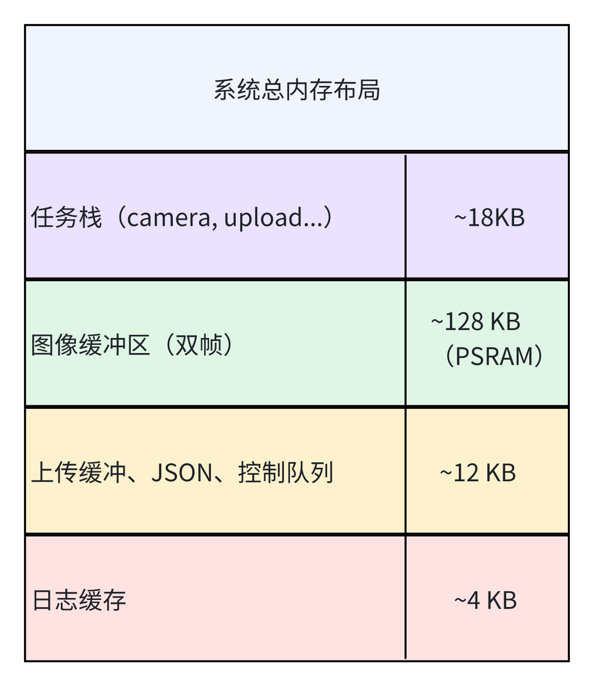

## 上层子系统功能模块（ESP32-S3）

### 1.1 功能概览


- **图像采集模块**：通过 OV2640 摄像头获取图像帧。
- **数据上传模块**：将图像数据发送至云端服务器（支持 UART/Wi-Fi MQTT/HTTP）。

- **结果解析模块**：接收云端返回的检测结果（目标类别、方向等）。

- **指令转发模块**：将结果转换为控制指令，通过 UART 下发至 ESP32-C2。

### 1.2 时间调度机制设计

#### 1.2.1 任务设计

（1）调度方式

​	基于 FreeRTOS 的抢占式多任务调度；

（2）任务划分与优先级

| 任务名                  | 优先级 | 周期/触发方式        | 说明                           |
| ----------------------- | ------ | -------------------- | ------------------------------ |
| `camera_task`           | 中     | 周期定时触发         | 图像采集任务，约每 200ms 一帧  |
| `image_upload_task`     | 高     | 事件驱动（图像可用） | 上传图像至云端，支持失败重传   |
| `result_parse_task`     | 高     | 事件驱动（返回结果） | 接收云端推理结果并提取控制信息 |
| `motor_control_tx_task` | 中低   | 事件驱动（指令就绪） | 将控制指令发送至下层 ESP32-C2  |

- `camera_task` 通过定时器驱动，作为系统起点；

- `image_upload_task` 在图像缓冲队列有新图像时启动，优先级高，确保实时上传；

- `result_parse_task` 等待推理结果返回后立即处理，优先级同样高；

- `motor_control_tx_task` 根据解析后的结果再封装并发送控制命令，优先级可略低以避免抢占上传/解析过程。

（3）通信机制

​	使用 FreeRTOS 队列 / 信号量 / 事件组协调任务执行；

（4）超时处理

​	上传失败后退避重传，指令执行超时警告等机制预留。

#### 1.2.2 任务调度时序图


**任务调度与反馈流程说明**

​	为满足系统响应及时性与可靠性需求，本系统基于 FreeRTOS 构建四大核心任务，并设计完整的任务调度与反馈机制。图 x 展示了图像采集至控制指令下发的完整时序路径：

- **图像采集任务 camera_task**：以 200ms 为周期进行图像采集，并将图像帧通过信号量通知上传任务；

- **图像上传任务 image_upload_task**：负责将图像上传至 AWS 云端，若上传失败则进行最多三次重试，并通过 `log_system` 输出日志；

- **推理结果解析任务 result_parse_task**：接收云端返回的 JSON 结果，若结构合法则提取动作信息，并通知控制任务；若格式异常则记录错误日志；

- **控制指令下发任务 motor_control_tx_task**：负责封装控制指令通过 UART 发送至下层 ESP32-C2，同时启动超时定时器监听 ACK；

- **ACK 机制**：若在规定时间内接收到 ACK，则流程结束；否则记录“控制失败”日志，提示系统调试或下层异常。

​	本设计实现了从图像采集 → 云端推理 → 指令下发 → 控制反馈 的**闭环控制链条**，满足项目中“响应时间 ≤ 400ms”、“上传/控制任务具备容错机制”的核心要求。

### 1.3 空间域内存与资源管理

#### 1.3.1 任务资源分配设计

| 任务名                  | 栈大小（字） | 栈大小（字节） | 缓冲资源                                        | 缓冲用途说明                       |
| ----------------------- | ------------ | -------------- | ----------------------------------------------- | ---------------------------------- |
| `camera_task`           | 768 words    | 3 KB           | 使用 DMA 双缓冲区（PSRAM 中每帧图像 ~60 KB）    | 摄像头帧采集，每 200ms 推送一次    |
| `image_upload_task`     | 1536 words   | 6 KB           | 图像上传缓冲区（64 KB PSRAM），状态码标志字节   | 支持 MQTT/HTTP 上行，失败重传机制  |
| `result_parse_task`     | 1024 words   | 4 KB           | 推理结果缓存（4 KB），控制结构体缓冲（512 B）   | 解析 JSON 格式结果，提取控制动作   |
| `motor_control_tx_task` | 768 words    | 3 KB           | 控制命令缓冲区（512 B），ACK 等待记录区（1 KB） | 处理 UART 指令下发，ACK 超时计时   |
| `log_system`            | 512 words    | 2 KB           | 环形日志缓存区（2~4 KB）                        | 记录失败上传、异常 JSON 等调试信息 |

#### 1.3.2 系统内存计算

| 模块         | 占用内存             | 说明                                           |
| ------------ | -------------------- | ---------------------------------------------- |
| 图像缓冲     | ~128 KB（2帧双缓冲） | 驱动层采集原始 YUV/RGB 数据，保存在 PSRAM      |
| 上传缓冲     | ~64 KB               | 与上传任务绑定，支持失败重传机制               |
| 任务栈总占用 | ~18 KB（任务栈）     | 5个主要任务，栈空间分配如上                    |
| JSON 缓冲区  | ~4 KB                | 用于临时存储推理返回值，result_parse_task 使用 |
| 控制命令缓存 | ~1 KB                | motor_control_tx_task 用于 UART ACK 管理       |
| 日志缓存     | ~4 KB                | 仅调试版本开启，可关闭以节省资源               |

#### 1.3.3 任务栈监控机制

​	为保障系统稳定性，所有任务启动后将周期性检测栈水位，避免溢出风险：

```c
// FreeRTOS 任务中使用
UBaseType_t stack_left = uxTaskGetStackHighWaterMark(NULL);
if (stack_left < 100) {
    ESP_LOGW("STACK", "Task %s nearing overflow: %d words left", pcTaskGetName(NULL), stack_left);
}
```

​	在调试版本中，配合 `vTaskList()` 或 ESP-IDF 的 CLI 工具 `esp_timer_dump()` 可输出所有任务运行状态、CPU 占用、剩余堆栈空间等。

#### 1.3.4 异常处理与资源保护

| 异常情形          | 处理机制                                                     |
| ----------------- | ------------------------------------------------------------ |
| 栈溢出            | 注册 FreeRTOS 钩子函数 `vApplicationStackOverflowHook()` 打印任务名并重启系统 |
| 上传失败          | 记录日志 → 指定次数后丢弃 / 重传                             |
| JSON 异常         | result_parse_task 记录异常 → 进入 fallback 状态              |
| 控制命令 ACK 超时 | 自动触发 resend，3 次失败后上报 Log                          |

#### 1.3.5 空间管理设计总结图



### 1.4 代码结构设计（面向对象分层架构）

​	为了增强系统的模块化、可维护性与可扩展性，本项目采用标准的 **三层面向对象架构**，将上层控制逻辑、设备驱动与中间适配逻辑进行**解耦封装**，并构建清晰的接口与职责边界。整体代码结构如下图所示：

#### 1.4.1 分层结构说明

| 层级              | 功能职责                           | 模块示例                                      | 对上提供           | 对下依赖                 |
| ----------------- | ---------------------------------- | --------------------------------------------- | ------------------ | ------------------------ |
| **App 层**        | 实现系统的功能业务逻辑与调度       | `camera_task`、`upload_task`、`motor_tx_task` | UI或用户逻辑       | Middleware接口           |
| **Middleware 层** | 封装通信、日志、解析等通用服务模块 | `cloud_comm`、`result_parser`、`log_system`   | App层任务          | Driver层接口             |
| **Driver 层**     | 控制底层硬件寄存器或调用 HAL SDK   | `camera_driver`、`uart_driver`                | Middleware底层控制 | ESP-IDF SDK / 硬件寄存器 |

#### 1.4.2 代码结构设计示意图

（1）代码目录初步设计

```text
project_root/
├── app/
│   ├── camera_task.cpp         # 摄像头采集任务
│   ├── upload_task.cpp         # 图像上传任务
│   └── command_task.cpp        # 控制命令处理任务

├── middleware/
│   ├── uploader.cpp            # 图像上传中间封装模块（MQTT/HTTP）
│   ├── json_parser.cpp         # 结果解析与封装模块
│   └── motor_encoder.cpp       # 控制指令编码器（封装驱动调用）

├── drivers/
│   ├── ov2640_driver.c         # OV2640 摄像头底层驱动
│   ├── uart_driver.c           # UART 通信驱动
│   └── mqtt_client.c           # MQTT 通信驱动模块
```

（2）UML包含关系示意图


#### 1.4.3代码结构设计策略

（1） App 层策略

- 每个业务功能独立封装为一个任务类（如图像上传、控制执行）
- 不依赖具体硬件、通信协议
- 示例：`UploaderTask.run()` → 调用 middleware 中的 `Uploader.upload(img)`

（2）Middleware 层策略

- 封装跨模块复杂操作（如图像采集 → 编码 → 上传）
- 使用接口隔离硬件差异与协议细节
- 错误处理、日志、状态跟踪也在此处理
- 目标是实现“平台无关的功能调用”

（3） Driver 层策略

- 仅封装具体平台调用（如 ESP-IDF HAL）
- 每个硬件模块/协议一个 driver 文件
- 更换设备时，只修改该层