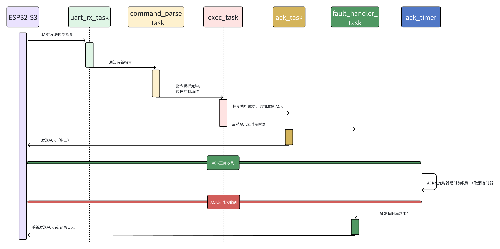
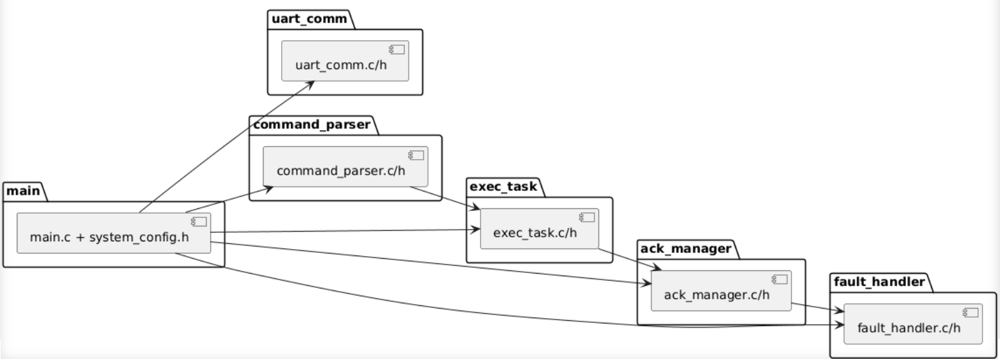

## 下层子系统功能模块（ESP32-C2）

### 1.1 功能概览


- 串口接收模块：接收来自 ESP32-S3 的控制指令（通常为 JSON 格式），UART 驱动支持

- 指令解析模块：解析接收到的控制命令，提取操作内容（如“转动”“停止”等），含校验与合法性判断，确保执行安全

- 执行模块：将解析出的命令映射到具体硬件操作，如电机控制、GPIO 输出

- ACK 反馈模块：对每条指令响应 ACK，确认执行状态（成功 / 超时 / 错误），定时触发或中断驱动，提升通讯可靠性

- 异常处理模块：处理如命令非法、执行失败、硬件响应超时等异常，提供 fail-safe 策略，可重发或记录错误码

### 1.2 时间调度机制设计

#### 1.2.1 任务划分与说明

| 任务名             | 优先级 | 调度方式      | 功能说明                                       |
| ------------------ | ------ | ------------- | ---------------------------------------------- |
| uart_rx_task       | 高     | 事件驱动      | 监听串口接收缓冲区，接收控制指令               |
| command_parse_task | 中     | 事件驱动      | 解析收到的 JSON 控制命令，提取控制指令内容     |
| exec_task          | 中     | 事件驱动      | 执行相应动作，如 GPIO 输出或 PWM 控制电机      |
| ack_task           | 中     | 定时/事件驱动 | 发送 ACK 消息，反馈执行状态                    |
| fault_handler_task | 中低   | 异常触发      | 监控硬件异常或指令格式错误，执行容错或保护动作 |

#### 1.2.2 任务调度时序图



**任务调度与反馈流程说明**

- **uart_rx_task**：负责通过 UART 接收来自 ESP32-S3 的控制指令，并将原始数据传递给解析任务。

- **command_parse_task**：对指令进行语义解析，提取目标动作，并通知执行任务处理。

- **exec_task**：依据解析结果进行控制动作执行，并在完成后通知 ACK 任务发送确认。

- **ack_task**：执行 ACK 反馈的准备和发送，并启动超时检测定时器。

- **ack_timer**：作为软件定时器用于检测 ACK 是否在规定时间内收到反馈结果，若超时未收到将通知异常处理。

- **fault_handler_task**：负责处理 ACK 超时事件，可选择重新发送 ACK 或记录日志/触发恢复策略。

**两种反馈情况：**

- ✅ **正常：ESP32-S3 在规定时间内返回“ACK已收到”，则定时器任务被中止。**
- ❌ **异常：若超时未收到 ACK 反馈，则 `ack_timer` 触发超时事件，通知 `fault_handler_task` 执行相应处理（记录日志或重发ACK）。**

### 1.3 空间域内存与资源管理

#### 1.3.1 任务资源分配设计

| 任务名称             | 栈大小（words） | 栈大小（bytes） | 说明                                    |
| -------------------- | --------------- | --------------- | --------------------------------------- |
| `uart_rx_task`       | 1024            | 4096            | 串口接收任务，需留足中断缓冲            |
| `command_parse_task` | 1024            | 4096            | 包含字符串处理、参数判断、JSON 解析逻辑 |
| `exec_task`          | 768             | 3072            | 控制逻辑不复杂，但不能中断过久          |
| `ack_task`           | 512             | 2048            | 及时响应，延迟容忍度低                  |
| `ack_timer`          | 512             | 2048            | 定时精度要求高，使用软件定时器栈        |
| `fault_handler_task` | 512             | 2048            | 异常处理任务，一般空闲运行              |

#### 1.3.2 系统内存计算

| 项目                         | 使用情况（估算） |
| ---------------------------- | ---------------- |
| 可用 RAM                     | ~272 KB          |
| 固定开销（启动区、堆、系统） | ~64 KB           |
| 总任务栈空间                 | ~6 KB            |
| 剩余堆空间                   | ~200 KB+         |

#### 1.3.3 任务栈监控机制

为保障系统稳定性，所有任务启动后将周期性检测栈水位，避免溢出风险：

```c
// FreeRTOS 任务中使用
UBaseType_t stack_left = uxTaskGetStackHighWaterMark(NULL);
if (stack_left < 100) {
    ESP_LOGW("STACK", "Task %s nearing overflow: %d words left", pcTaskGetName(NULL), stack_left);
}
```

​	在调试版本中，配合 `vTaskList()` 或 ESP-IDF 的 CLI 工具 `esp_timer_dump()` 可输出所有任务运行状态、CPU 占用、剩余堆栈空间等。

#### 1.3.4 异常处理与资源保护

- 超时未收到 ACK → 触发 `fault_handler_task`，记录异常，避免 ACK 队列溢出

- 若检测到任务空闲栈过低，可主动 `restart()` 重启（开发版阶段）

- 某些模块可设计为 *watchdog-safe*，即加入 `esp_task_wdt_add()` 强制监控

#### 1.3.5 空间管理设计总结构图


### 1.4 代码结构设计

#### 1.4.1 代码目录初步设计

```plaintext
project_root/
├── main/
│   ├── main.c                    // 应用入口，任务注册与初始化
│   ├── uart_comm.c/.h           // 串口收发模块（含中断处理、缓冲机制）
│   ├── command_parser.c/.h      // 指令解析模块（命令拆解、参数识别）
│   ├── exec_task.c/.h           // 控制执行模块（如控制电机、触发动作）
│   ├── ack_manager.c/.h         // ACK 反馈 + 超时机制（含软件定时器）
│   ├── fault_handler.c/.h       // 异常监测与容错处理
│   └── system_config.h          // 优先级、栈大小、日志等级等参数配置
├── CMakeLists.txt               // 构建入口
└── sdkconfig                    // menuconfig 生成配置
```

#### 1.4.2 UML包含关系示意图


