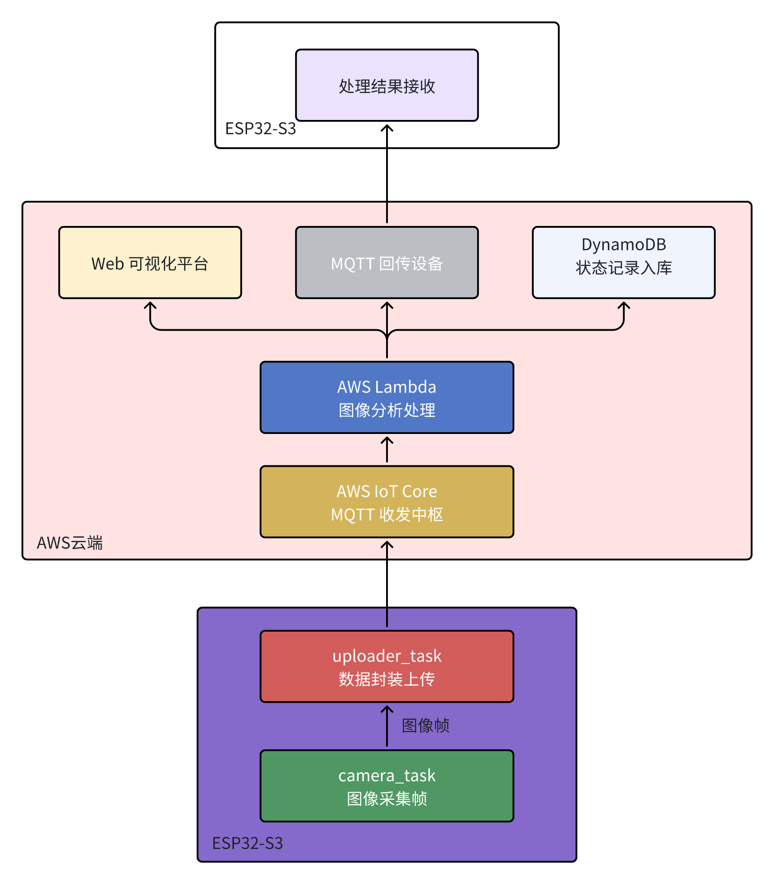

##  云端服务器模块（AWS）

## 1 总体设计概述

### 1.1 系统组成与功能概览

- **ESP32-S3** : 捕获图像并通过 MQTT 上行发送至 AWS IoT Core
- **AWS IoT Core** : 提供 MQTT 通信接口，ESP32-S3 向其上传图像、接收 ACK。

- **Lambda 触发器** : 接收 MQTT 消息并触发图像处理或逻辑判断，可实现无服务器架构。
- **图像处理模块** : 对上传图像进行处理（如人脸检测/事件判断），可集成 Sagemaker 或调用模型接口。
- **结果判断模块** : 根据图像或指令内容判断控制逻辑，生成反馈消息。 
- **DynamoDB 状态存储** : 保存判断结果与历史状态，供 Web 端查询。
- **Web 可视化平台**：展示结果状态，辅助调试与远程监控。
- **ACK / 控制反馈** : 将执行结果封装成 MQTT 消息，发送给终端设备。

## 2 技术栈与部署方案

### 2.1 技术栈总览

- **基础通信通路**

| 阶段目标                                 | 技术组件 / 服务                                              | 说明                                                    |
| ---------------------------------------- | ------------------------------------------------------------ | ------------------------------------------------------- |
| 建立终端图像上传、云端接收与反馈回传通路 | 🔹 ESP32-S3（摄像采集、MQTT上传）  🔹 MQTT over TLS 🔹 AWS IoT Core 🔹 AWS Lambda（触发器） | 建立图像上行链路和基本控制下行链路，先实现端-云交互闭环 |

- **图像识别与逻辑判断**

| 阶段目标                                     | 技术组件 / 服务                                              | 说明                                                         |
| -------------------------------------------- | ------------------------------------------------------------ | ------------------------------------------------------------ |
| 添加图像处理与判断流程，具备初步智能分析能力 | 🔹 Lambda 图像处理逻辑（Python） 🔹 可选集成 AWS SageMaker 🔹 AWS-S3 存图模块 🔹 结果判断模块（本地逻辑或模型） | 图像处理/推理过程可写在 Lambda 内部，支持模型调用或自定义逻辑 |

- **状态记录与可视化拓展**

| 阶段目标                                  | 技术组件 / 服务                                              | 说明                                                    |
| ----------------------------------------- | ------------------------------------------------------------ | ------------------------------------------------------- |
| 增加状态持久化、后台控制和 Web 可视化支持 | 🔹 AWS DynamoDB（状态/记录） 🔹 Web 可视化前端 + REST API（可选） 🔹 AWS API Gateway（可选） 🔹 权限控制：IAM + IoT Policy | 实现多端信息同步、Web控制与可追溯分析，便于后期迭代扩展 |

### 2.2 技术架构分阶段说明

- **基础通信通路构建**

（1）阶段目标

​	建立从边缘设备（ESP32-S3）到云端（AWS IoT）的稳定图像上传链路，确保摄像头图像能够成功采集、封装、上传并由云端服务接收与处理，为后续控制逻辑与推理系统奠定通信基础。

（2）系统组成与任务划分

| 功能模块   | 所属平台     | 关键任务        | 作用说明                               |
| ---------- | ------------ | --------------- | -------------------------------------- |
| 摄像头采集 | ESP32-S3     | `camera_task`   | 周期性采集图像（JPEG）                 |
| 数据封装   | ESP32-S3     | `uploader_task` | 将图像转换为 base64，并封装为 JSON     |
| 消息上传   | ESP32-S3     | `mqtt_client`   | 通过 MQTT over TLS 上传至 AWS IoT Core |
| 云端入口   | AWS IoT Core | 规则引擎        | 将 MQTT 消息触发转发至 Lambda          |
| 数据接收   | AWS Lambda   | 处理函数        | 解析 JSON，并记录或写入 S3（可选）     |

- **图像识别与逻辑判断**

（1）阶段目标

​	在完成图像采集与上传的基础上，进一步构建图像识别能力与逻辑判断机制。通过 AWS Lambda 或 SageMaker 模型分析图像内容，并根据识别结果做出智能判断，为后续控制与状态记录打下基础。

（2）系统组成与任务划分

| 功能模块         | 所属平台               | 关键任务           | 作用说明                                           |
| ---------------- | ---------------------- | ------------------ | -------------------------------------------------- |
| 图像解析         | AWS Lambda             | 图像解码模块       | 解码 base64 图像，并准备输入模型                   |
| 图像识别推理     | AWS Lambda / SageMaker | 推理服务调用模块   | 调用训练好的图像识别模型，进行目标检测或分类       |
| 逻辑判断         | AWS Lambda             | 规则引擎或判断模块 | 根据识别结果进行逻辑判断，生成下一步处理指令或标记 |
| 回传机制（可选） | AWS Lambda → ESP32-S3  | MQTT Client        | 将判断结果封装为响应消息，通过 MQTT 发送回边缘设备 |

- **状态记录与可视化拓展**

（1）阶段目标

​	建立云端状态记录与可视化能力，实现图像识别结果与系统状态的持久化存储、查询与展示，为后续扩展监控平台与用户交互界面奠定基础。

（2）系统组成与任务划分

| 功能模块         | 所属平台            | 关键任务           | 作用说明                                             |
| ---------------- | ------------------- | ------------------ | ---------------------------------------------------- |
| 图像识别结果处理 | AWS Lambda          | 逻辑判断           | 提取识别结果，并结构化为状态记录项                   |
| 状态存储         | AWS DynamoDB        | 数据写入           | 将结构化结果写入云端 NoSQL 数据库                    |
| 可视化平台       | Web 前端 + REST API | 前端展示，API 查询 | 展示识别记录、状态变化等信息，支持多维数据筛选与访问 |
| 权限控制         | AWS IAM/IoT Policy  | 身份验证与访问控制 | 管理前端访问权限与 API 使用策略                      |

## 3 阶段任务划分与处理流程

### 3.1 阶段目标与分工概述

​	为了确保云端服务器模块（AWS）具备良好的可扩展性、可维护性与阶段性交付能力，系统整体设计被划分为三个核心阶段。各阶段以功能闭环为目标，逐步完成从边缘图像上传、云端智能识别到系统状态存储与可视化的完整能力建设。

#### 3.1.1 边缘设备与云端通信通路构建

**阶段目标**：建立稳定可靠的边云通信链路，ESP32-S3 设备能够周期性捕获图像并通过 MQTT over TLS 协议上传至 AWS IoT Core，由后者通过规则引擎转发至 Lambda 函数，实现从终端到云端的数据上行。

**关键职责**：

- ESP32-S3：图像采集、封装、MQTT 上传
- AWS IoT Core：接收消息、触发 Lambda
- Lambda（阶段一职责）：记录日志或简单存储验证

**阶段交付判断标准**：

- MQTT 连接建立成功（TLS 双向认证）
- 图像上传消息能触发 Lambda
- 云端成功打印或记录接收到的图像信息

#### 3.1.2 图像识别与控制逻辑闭环构建

**阶段目标**：实现云端对上传图像的智能分析与自动化判断处理，构建由 Lambda 驱动的推理判断闭环，并具备结果回传能力。

**关键职责**：

- Lambda：图像 base64 解码 → 模型推理（可调用 SageMaker 或本地模型）→ 判断结果生成
- 可选：将判断结果封装为 MQTT 消息，回传 ESP32 执行响应动作（如控制舵机/显示）

**阶段交付判断标准**：

- Lambda 成功完成图像解码 + 调用推理函数
- 推理结果可结构化输出，支持进一步控制判断
- 可实现图像上传 → 云端判断 → 回传指令的完整流程

#### 3.1.3  状态记录与系统可视化拓展

**阶段目标**：将系统识别与判断的结果结构化存储在云端数据库（DynamoDB），并支持通过 Web 前端或其他方式进行查询、展示与分析，构建用户友好的可视化与数据追踪平台。

**关键职责**：

- Lambda：将识别结果写入 DynamoDB 表
- DynamoDB：持久化保存状态/事件记录
- Web 可视化平台（可选）：展示识别历史、设备状态、事件记录等

**阶段交付判断标准**：

- 状态结果字段清晰（如识别成功/失败、识别对象、时间戳）
- DynamoDB 查询接口可用，支持按时间/设备 ID 查询
- 可通过前端展示识别状态流、错误率趋势、图像样本等内容

### 3.2 各阶段系统任务划分表

​	本系统按照阶段目标进行任务分解，每个任务绑定具体的功能模块与所属平台，明确其在数据流中的角色与责任边界，以便后续开发、测试和调试时能够模块化、分层推进。

#### 3.2.1 边云通信通路构建

| 所属平台     | 功能模块      | 任务名称         | 职责说明                                                     |
| ------------ | ------------- | ---------------- | ------------------------------------------------------------ |
| ESP32-S3     | camera_driver | `camera_task`    | 周期性采集摄像头图像帧（JPEG 格式），并将图像帧指针推入上传缓冲区 |
| ESP32-S3     | mqtt_uploader | `uploader_task`  | 从图像缓冲区中读取帧，进行 base64 编码和 JSON 封装，并通过 MQTT over TLS 上传至 AWS IoT Core |
| AWS IoT Core | 规则引擎      | 触发规则         | 接收设备 MQTT 消息，并根据 topic 规则自动转发至 AWS Lambda   |
| AWS Lambda   | receiver_fn   | `lambda_handler` | 解析上传的 JSON 消息内容，提取设备 ID、图像数据等，记录日志或简单返回（后续阶段用于推理） |

#### 3.2.2 图像识别与逻辑判断

| 所属平台   | 功能模块         | 任务名称         | 职责说明                                            |
| ---------- | ---------------- | ---------------- | --------------------------------------------------- |
| AWS Lambda | image_decoder    | base64 图像解码  | 将上传图像还原为二进制 JPEG 文件                    |
| AWS Lambda | inference_engine | 模型推理调用     | 加载模型（本地或调用 SageMaker Endpoint）并进行识别 |
| AWS Lambda | result_evaluator | 判断与指令生成   | 根据识别结果进行逻辑判断，决定动作/输出标签         |
| AWS Lambda | mqtt_responder   | 回传指令（可选） | 构建 MQTT 消息发送至目标 topic，实现设备控制闭环    |

#### 3.2.3 状态记录与可视化拓展

| 所属平台               | 功能模块       | 任务名称         | 职责说明                                         |
| ---------------------- | -------------- | ---------------- | ------------------------------------------------ |
| AWS Lambda             | state_logger   | 状态记录写入     | 结构化识别结果并写入 DynamoDB（主键：设备+时间） |
| AWS DynamoDB           | 状态表         | 数据持久化       | 提供状态记录的 NoSQL 存储能力                    |
| Web 可视化平台（可选） | ui_frontend    | 状态展示         | 展示识别结果、设备状态、历史记录等               |
| REST API（可选）       | data_query_api | 数据查询接口     | 提供 Web 前端访问 DynamoDB 的中间层服务          |
| AWS IAM & IoT Policy   | 权限管理       | 访问控制策略配置 | 控制设备与服务间访问权限，确保安全通信           |

### 3.3 任务处理流程图与触发逻辑

​	本节将结合系统任务链路，从边缘设备图像采集、封装上传，到云端触发处理、状态记录与可视化的全过程，描述各任务之间的执行顺序、触发关系及关键通信节点。

#### 3.3.1 总体任务流程图

#### 3.3.2 任务链路说明与触发逻辑

**(1) `camera_task` → `uploader_task`（ESP32 内部）**

- **触发机制**：定时器触发（或外部事件）
- **说明**：`camera_task` 周期性采集一帧图像，并通过缓冲区或队列将图像传递给 `uploader_task`
- **设计目的**：采集任务与上传任务解耦，保证采集帧率稳定，即使上传阻塞也不影响采集节奏

**(2) `uploader_task` → `AWS IoT Core`**

- **触发机制**：图像就绪事件（队列/信号量）
- **说明**：
  - `uploader_task` 获取图像后进行 base64 编码和 JSON 封装
  - 通过 `mqtt_client` 以 QoS 1 或 QoS 0 发布至指定 topic，如 `device/esp32/image`
- **安全说明**：采用 TLS 认证的 MQTT 连接，确保数据传输安全

**(3) `AWS IoT Core` → `AWS Lambda`**

- **触发机制**：MQTT topic 规则引擎触发
- **说明**：
  - IoT Core 根据预定义的 topic 规则，将符合条件的上传消息转发给绑定的 Lambda 函数
  - 完全无服务器方式，响应时间通常低于 100ms

**(4) `AWS Lambda` 内部流程**

- **触发机制**：由 IoT Core 自动触发，事件驱动
- **任务流程**：
  - 解析 MQTT 消息 JSON
  - 解码 base64 图像
  - 调用模型（本地 or SageMaker Endpoint）进行推理
  - 根据推理结果进行逻辑判断（如是否为注册人脸）
- **性能说明**：模型调用建议设置超时保护（如 <1s），避免阻塞链路

**(5) `AWS Lambda` → `DynamoDB`（状态记录）**

- **触发机制**：Lambda 内函数调用（同步执行）
- **说明**：
  - 将推理结果结构化后写入 DynamoDB 表中
  - 字段通常包括 device_id、timestamp、action_taken、result、image_path（可选）

**(6) `AWS Lambda` → ESP32**

- **触发机制**：基于判断结果主动构建 MQTT 消息
- **说明**：
  - 若需要控制终端行为，如解锁门禁，可将控制结果封装为 JSON，通过另一个 topic（如 `device/esp32/cmd`）下发
  - ESP32 必须订阅该 topic 并注册回调处理

**(7) `Web 可视化平台` → `DynamoDB`**

- **触发机制**：用户主动查询（REST API / WebSocket）
- **说明**：
  - 前端页面可按时间、设备 ID 查询状态变化与识别记录
  - 可配合图像预览、告警列表展示，提高可运维性
