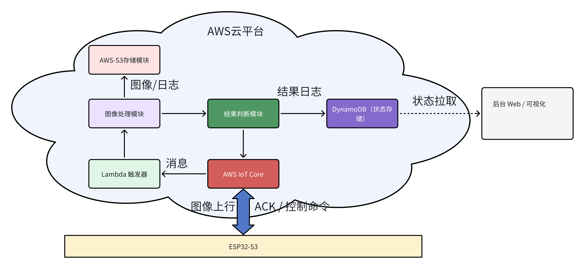
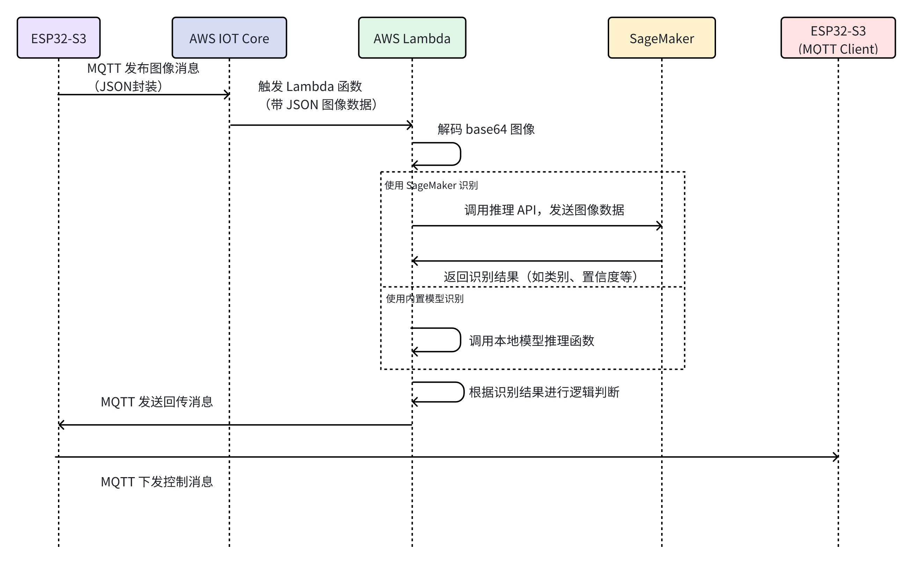
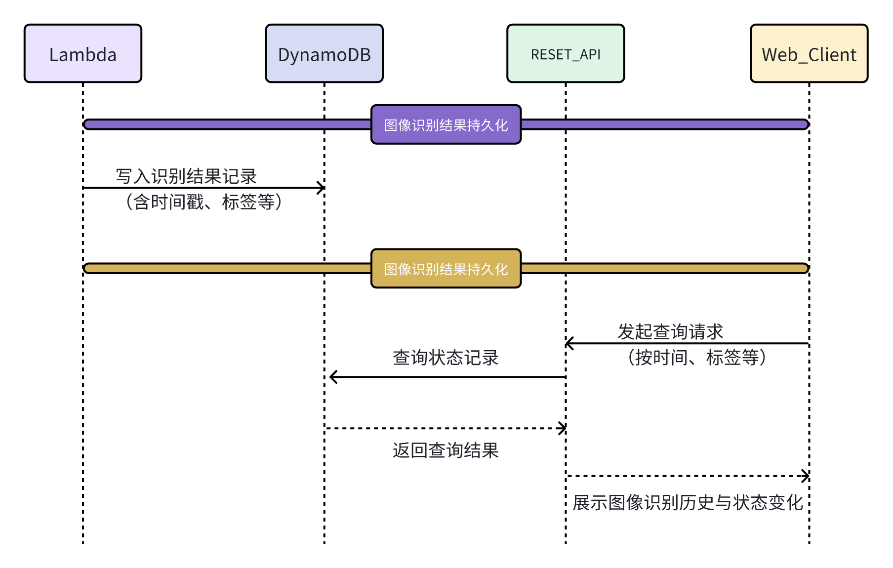

##  云端服务器模块（AWS）

### 1.1 功能概览

- **ESP32-S3** : 捕获图像并通过 MQTT 上行发送至 AWS IoT Core
- **AWS IoT Core** : 提供 MQTT 通信接口，ESP32-S3 向其上传图像、接收 ACK。

- **Lambda 触发器** : 接收 MQTT 消息并触发图像处理或逻辑判断，可实现无服务器架构。
- **图像处理模块** : 对上传图像进行处理（如人脸检测/事件判断），可集成 Sagemaker 或调用模型接口。
- **结果判断模块** : 根据图像或指令内容判断控制逻辑，生成反馈消息。 
- **DynamoDB 状态存储** : 保存判断结果与历史状态，供 Web 端查询。
- **Web 可视化平台**：展示结果状态，辅助调试与远程监控。
- **ACK / 控制反馈** : 将执行结果封装成 MQTT 消息，发送给终端设备。

### 1.2 技术栈与部署方案

#### 1.2.1 技术栈总览

- **基础通信通路**

| 阶段目标                                 | 技术组件 / 服务                                              | 说明                                                    |
| ---------------------------------------- | ------------------------------------------------------------ | ------------------------------------------------------- |
| 建立终端图像上传、云端接收与反馈回传通路 | 🔹 ESP32-S3（摄像采集、MQTT上传）  🔹 MQTT over TLS 🔹 AWS IoT Core 🔹 AWS Lambda（触发器） | 建立图像上行链路和基本控制下行链路，先实现端-云交互闭环 |

- **图像识别与逻辑判断**

| 阶段目标                                     | 技术组件 / 服务                                              | 说明                                                         |
| -------------------------------------------- | ------------------------------------------------------------ | ------------------------------------------------------------ |
| 添加图像处理与判断流程，具备初步智能分析能力 | 🔹 Lambda 图像处理逻辑（Python） 🔹 可选集成 AWS SageMaker 🔹 AWS-S3 存图模块 🔹 结果判断模块（本地逻辑或模型） | 图像处理/推理过程可写在 Lambda 内部，支持模型调用或自定义逻辑 |

- **状态记录与可视化拓展**

| 阶段目标                                  | 技术组件 / 服务                                              | 说明                                                    |
| ----------------------------------------- | ------------------------------------------------------------ | ------------------------------------------------------- |
| 增加状态持久化、后台控制和 Web 可视化支持 | 🔹 AWS DynamoDB（状态/记录） 🔹 Web 可视化前端 + REST API（可选） 🔹 AWS API Gateway（可选） 🔹 权限控制：IAM + IoT Policy | 实现多端信息同步、Web控制与可追溯分析，便于后期迭代扩展 |

#### 1.2.2 技术架构分阶段说明

- **基础通信通路构建**

（1）阶段目标

​	建立从边缘设备（ESP32-S3）到云端（AWS IoT）的稳定图像上传链路，确保摄像头图像能够成功采集、封装、上传并由云端服务接收与处理，为后续控制逻辑与推理系统奠定通信基础。

（2）系统组成与任务划分

| 功能模块   | 所属平台     | 关键任务        | 作用说明                               |
| ---------- | ------------ | --------------- | -------------------------------------- |
| 摄像头采集 | ESP32-S3     | `camera_task`   | 周期性采集图像（JPEG）                 |
| 数据封装   | ESP32-S3     | `uploader_task` | 将图像转换为 base64，并封装为 JSON     |
| 消息上传   | ESP32-S3     | `mqtt_client`   | 通过 MQTT over TLS 上传至 AWS IoT Core |
| 云端入口   | AWS IoT Core | 规则引擎        | 将 MQTT 消息触发转发至 Lambda          |
| 数据接收   | AWS Lambda   | 处理函数        | 解析 JSON，并记录或写入 S3（可选）     |

（3）系统时序图

​	图像采集任务从 camera_task 启动，经过 uploader_task 编码后通过 mqtt_client 向 AWS IoT Core 发送 MQTT 消息，触发 Lambda 函数，解析图像数据并可选上传至 S3，实现从终端到云端的基础通信路径构建。

- **图像识别与逻辑判断**

（1）阶段目标

​	在完成图像采集与上传的基础上，进一步构建图像识别能力与逻辑判断机制。通过 AWS Lambda 或 SageMaker 模型分析图像内容，并根据识别结果做出智能判断，为后续控制与状态记录打下基础。

（2）系统组成与任务划分

| 功能模块         | 所属平台               | 关键任务           | 作用说明                                           |
| ---------------- | ---------------------- | ------------------ | -------------------------------------------------- |
| 图像解析         | AWS Lambda             | 图像解码模块       | 解码 base64 图像，并准备输入模型                   |
| 图像识别推理     | AWS Lambda / SageMaker | 推理服务调用模块   | 调用训练好的图像识别模型，进行目标检测或分类       |
| 逻辑判断         | AWS Lambda             | 规则引擎或判断模块 | 根据识别结果进行逻辑判断，生成下一步处理指令或标记 |
| 回传机制（可选） | AWS Lambda → ESP32-S3  | MQTT Client        | 将判断结果封装为响应消息，通过 MQTT 发送回边缘设备 |

（3）系统时序图

​	阶段二通过 AWS Lambda 对上传图像进行智能识别与逻辑判断，必要时将结果回传至边缘设备，实现云端决策与本地响应的闭环控制。

- **状态记录与可视化拓展**

（1）阶段目标

​	建立云端状态记录与可视化能力，实现图像识别结果与系统状态的持久化存储、查询与展示，为后续扩展监控平台与用户交互界面奠定基础。

（2）系统组成与任务划分

| 功能模块         | 所属平台            | 关键任务           | 作用说明                                             |
| ---------------- | ------------------- | ------------------ | ---------------------------------------------------- |
| 图像识别结果处理 | AWS Lambda          | 逻辑判断           | 提取识别结果，并结构化为状态记录项                   |
| 状态存储         | AWS DynamoDB        | 数据写入           | 将结构化结果写入云端 NoSQL 数据库                    |
| 可视化平台       | Web 前端 + REST API | 前端展示，API 查询 | 展示识别记录、状态变化等信息，支持多维数据筛选与访问 |
| 权限控制         | AWS IAM/IoT Policy  | 身份验证与访问控制 | 管理前端访问权限与 API 使用策略                      |

（3）系统时序图

​	基于前一阶段的图像识别结果，完成系统状态的结构化处理、云端存储和可视化展示。通过将识别信息上传至 AWS DynamoDB 进行状态记录，并结合可选的 Web 前端与 REST API 接口，实现系统运行状态的远程监控与人机交互能力的拓展，为后续功能升级和业务集成打下基础。
