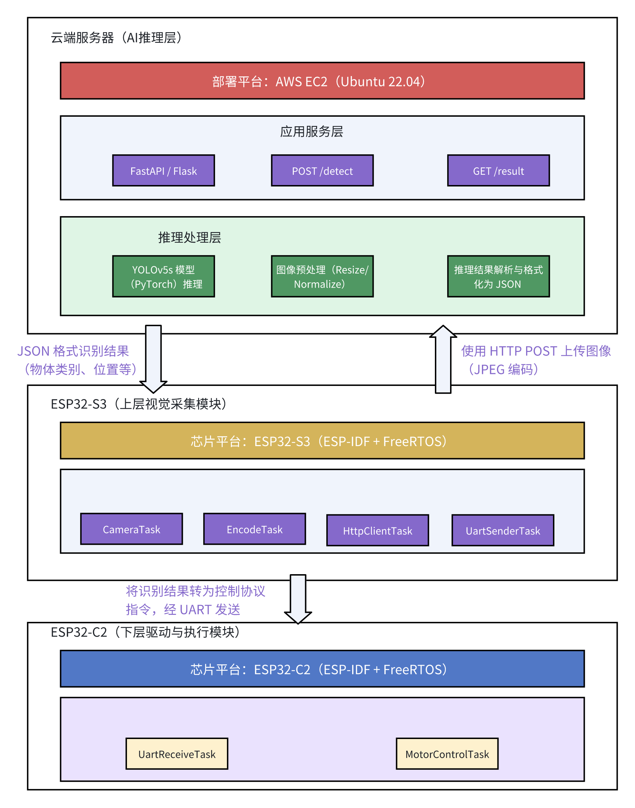
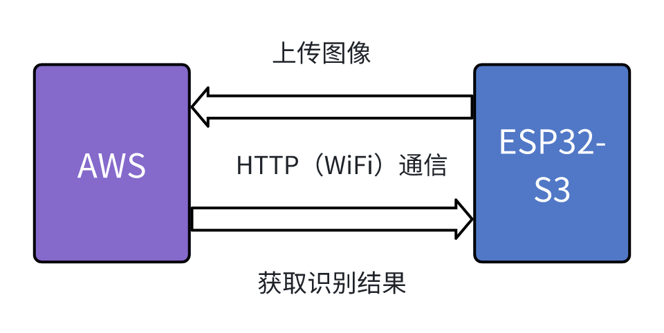
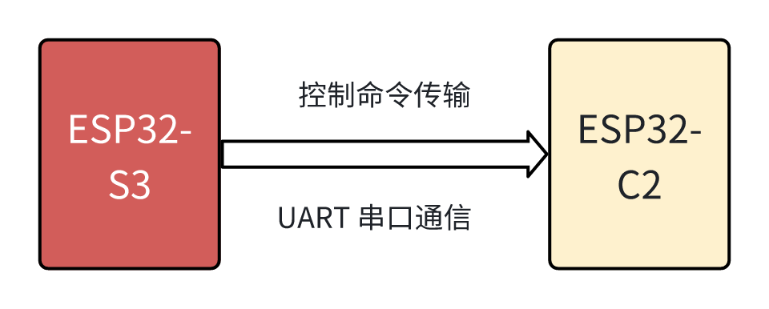

# 项目总览文档

## 1 项目背景与目标

### 1.1 项目背景

​	本项目基于 Espressif 官方社区开源项目 [ESP-SparkBot](https://gitee.com/esp-friends/esp_sparkbot) 的工程框架，原始项目以 ESP32-S3 为核心，集成了语音交互、图像识别、舵机控制与本地 AI 功能，具有较强的完整性和商品化潜力。但原始项目的 AI 能力仍以本地部署为主，且功能侧重于语音播放、2048 游戏、人脸检测等交互展示，**尚未覆盖实际嵌入式 AI 领域中“云端部署+高级识别”的应用需求**。

​	当前行业趋势正从本地部署逐步向 **端云一体的智能边缘协同架构** 过渡，嵌入式设备不仅要具备感知与本地处理能力，还应具备 **与云端 AI 引擎协同工作** 的能力，例如支持高精度模型部署、远程推理、低延迟控制等。

​	因此，本项目拟在 ESP-SparkBot 原有图像采集与控制框架的基础上，完成面向**边缘智能 AI 协同控制**场景的功能拓展与系统重构。

### 1.2 项目目标

​	本项目总体目标为：**基于 ESP32-S3 + 云端服务器构建图像识别与智能控制一体化系统**，实现从图像采集 → 云端推理 → 控制响应的完整闭环，支持远程模型部署、非本地计算及模块化扩展。

​	本项目重点目标包括：

- **引入 AWS 云端部署结构**：构建 RESTful 服务接口，支持 YOLOv5 人脸/表情识别等模型的在线调用与返回；
- **实现本地/云端双模式识别切换**：系统支持配置切换识别模型调用方式，在保持本地识别能力的同时，增强远程协同推理能力；

- **系统工程化与模块化重构**：系统设计模块边界清晰，代码结构支持任务隔离、驱动封装和后期测试维护，具备实际落地能力；

- **支持舵机控制与状态反馈**：云端识别结果可用于实时下发控制指令，并实现基础通信 ACK 与超时反馈机制。

### 1.3 系统设计约束与性能目标

​	为保障系统稳定运行于资源受限的嵌入式平台，并实现高可靠性与较强实时性，项目在设计初期明确以下关键 **性能约束与非功能性目标**：

| 设计约束类型       | 具体要求                                                     |
| ------------------ | ------------------------------------------------------------ |
| **图像采集频率**   | 每 200ms 采集 1 帧（5fps），在保证控制响应及时性的前提下，控制 Wi-Fi 带宽占用和功耗负载 |
| **控制延迟上限**   | 从图像采集到下发控制指令的最大延迟 ≤ 400ms，确保舵机控制系统稳定 |
| **图像大小限制**   | 单帧图像压缩后大小 ≤ 50KB，上传时间控制在 150ms 内           |
| **云端推理延迟**   | YOLOv5s 模型推理时间 ≤ 200ms，返回 JSON 结构清晰、可直接提取动作信息 |
| **内存资源使用**   | ESP32-S3 总任务内存使用 ≤ 300KB，图像缓冲不超过 PSRAM 可用容量（~1MB） |
| **调度机制**       | 采用 FreeRTOS 抢占式调度，任务优先级区分图像上传、控制指令、日志监控 |
| **通信可靠性**     | 所有上/下行任务支持失败重传，控制通道具备 ACK 确认与超时报警机制 |
| **日志与容错机制** | 系统具备基础错误日志输出、通信失败告警与可选 watchdog 异常复位机制 |

## 2 系统结构

### 2.1 系统架构总览（模块分层）

### 2.2 模块功能说明

（1）云端AI推理服务（AWS EC2/S3）

| 功能            | 实现方式                           | 工具/技术                 |
| --------------- | ---------------------------------- | ------------------------- |
| YOLOv5 目标识别 | 云端 Python Flask + YOLO 模型服务  | AWS EC2 / FastAPI / Flask |
| 可拓展功能      | 加载人脸识别/表情识别/语音识别模型 | OpenCV / InsightFace 等   |
| 通信接口        | HTTP REST API                      | JSON POST 请求            |

（2）ESP32-S3（上层主控模块）

| 功能         | 实现方式                     | 工具/库                 |
| ------------ | ---------------------------- | ----------------------- |
| 图像采集     | OV2640 摄像头模块            | ESP-IDF / Camera driver |
| 图像上传     | JPEG压缩后 POST 上传至 AWS   | Wi-Fi / HTTP Client     |
| 云端结果解析 | 解析 YOLO 返回的 JSON 框坐标 | cJSON / 控制逻辑        |
| 指令下发     | UART Frame 编码              | UART 驱动               |

（3）ESP32-C2（下层运动控制模块）

| 功能     | 实现方式                                 | 工具 / 库                   |
| -------- | ---------------------------------------- | --------------------------- |
| 指令接收 | 通过 UART 接收上层 ESP32-S3 的控制帧     | UART 驱动（ESP-IDF）        |
| 指令解析 | 解析 UART 协议中的控制字段，提取动作信息 | 自定义协议解析 / 状态机实现 |
| 动作执行 | 控制电机执行前进/后退/转向/停止等动作    | 电机 PWM 控制 / GPIO 驱动   |

### 2.3 通信与控制结构

（1）通信结构

- 使用 HTTP 协议进行图像传输与识别结果回传；

- 实现边缘设备与 AI 云模型的解耦，提高模型更新灵活性；

（2）控制结构

- 使用 UART 串口进行低延时命令下发；
- 保持任务层与硬件驱动层的边界清晰，有利于后续维护与复用；

## 3 项目开发平台与工具

### 3.1 开发硬件平台

| 组件       | 型号       | 用途                                | 说明                       |
| ---------- | ---------- | ----------------------------------- | -------------------------- |
| 上层主控   | ESP32-S3   | 图像采集、Wi-Fi 通信、YOLO 结果交互 | 支持摄像头与 WiFi          |
| 下层驱动   | ESP32-C2   | 电机控制、串口通信                  | 低功耗，仅控制履带         |
| 摄像头模块 | OV2640     | 实时图像采集                        | 与 ESP32-S3 连接           |
| 连接方式   | 4P磁吸接口 | 电源 + UART                         | 两个引脚供电，两个引脚通信 |
| 供电方式   | USB / 电池 | 全系统供电                          | 适配板载电源模块           |

### 3.2 软件平台与操作系统

| 软件/固件      | 平台          | 用途           | 说明                       |
| -------------- | ------------- | -------------- | -------------------------- |
| ESP-IDF v5.3.2 | ESP32 环境    | 开发固件与调试 | 与原开源项目版本一致       |
| FreeRTOS       | MCU RTOS      | 多任务调度     | 上层控制与图像处理任务分离 |
| Ubuntu 20.04   | AWS 云服务器  | 部署 YOLO 模型 | 用于 Python/YOLO 运算      |
| Python 3.9+    | 云端环境      | 推理引擎       | YOLO 模型运行依赖版本      |
| YOLOv5/v8      | PyTorch-based | 云端推理模型   | 可选模型精度/速度平衡      |

### 3.3 云服务平台

| 服务                 | 提供商      | 功能             | 说明               |
| -------------------- | ----------- | ---------------- | ------------------ |
| AWS EC2              | Amazon      | 云服务器主机     | 运行 YOLO 推理模型 |
| AWS S3（可选）       | Amazon      | 数据存储         | 存图或日志         |
| AWS IoT Core（可选） | Amazon      | 设备通信管理     | 统一控制多设备     |
| 网络协议             | HTTP / MQTT | ESP32 ↔ 云端通信 | 控制命令和结果交互 |

### 3.4 开发工具链

| 工具             | 功能          | 说明                         |
| ---------------- | ------------- | ---------------------------- |
| VSCode + WSL     | 编写/烧录代码 | WSL 内配置 ESP-IDF 开发      |
| Git + GitHub     | 版本管理      | 分模块管理 esp-aws-yolo 工程 |
| ESP-IDF          | ESP-IDF IDE   | 若用 VSCode 插件集成也可行   |
| curl / requests  | 网络通信调试  | ESP32 HTTP 接口测试          |
| Jupyter Notebook | 云端调试      | 可部署可视化测试界面         |

