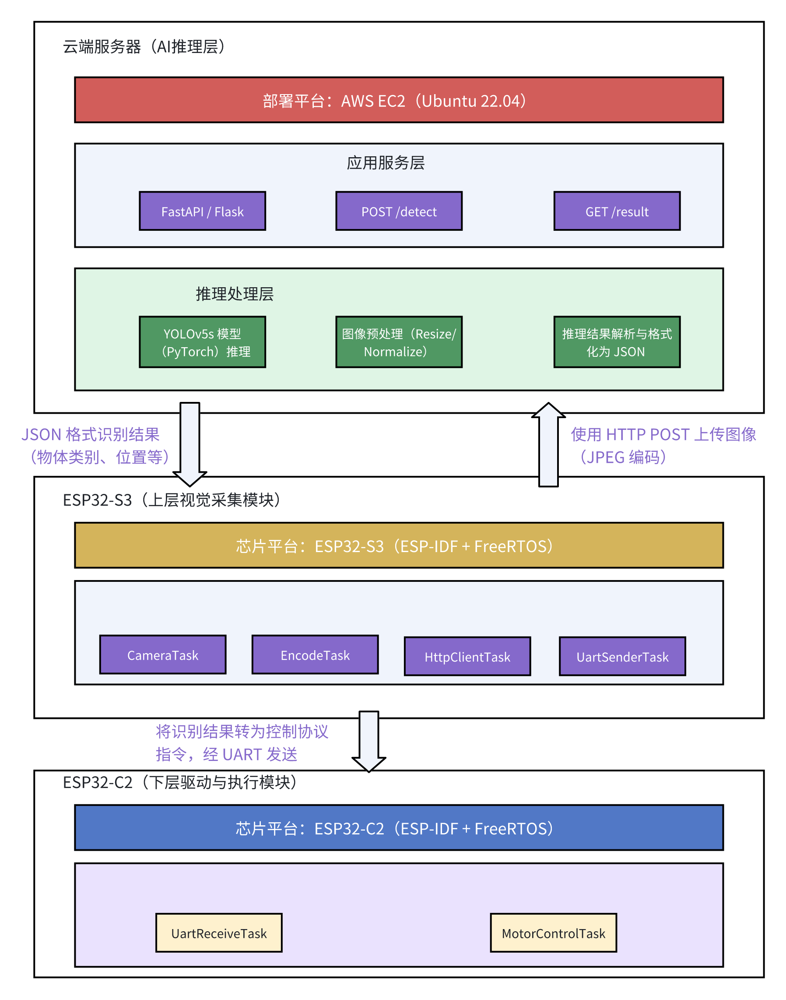

# 项目总览文档

## 1 项目背景与目标

​	本项目基于 Espressif 官方社区开源项目 [ESP-SparkBot](https://gitee.com/esp-friends/esp_sparkbot) 的工程框架，原始项目以 ESP32-S3 为核心，集成了语音交互、图像识别、舵机控制与本地 AI 功能，具有较强的完整性和商品化潜力。但原始项目的 AI 能力仍以本地部署为主，且功能侧重于语音播放、2048 游戏、人脸检测等交互展示，**尚未覆盖实际嵌入式 AI 领域中“云端部署+高级识别”的应用需求**。

​	因此，本项目在复用其硬件控制与图像采集模块的基础上，**重点进行以下功能拓展与系统重构**：

（1） **引入 AWS 云端部署架构**：构建 RESTful 接口，实现 YOLOv5、人脸识别、表情识别等模型的在线推理。

（2） **支持本地 / 云端识别双模式切换**：具备云端性能、同时保留本地部署兼容性。

## 2 系统结构

### 2.1 系统架构总览（模块分层）

### 2.2 模块功能说明

（1）云端AI推理服务（AWS EC2/S3）

| 功能            | 实现方式                           | 工具/技术                 |
| --------------- | ---------------------------------- | ------------------------- |
| YOLOv5 目标识别 | 云端 Python Flask + YOLO 模型服务  | AWS EC2 / FastAPI / Flask |
| 可拓展功能      | 加载人脸识别/表情识别/语音识别模型 | OpenCV / InsightFace 等   |
| 通信接口        | HTTP REST API                      | JSON POST 请求            |

（2）ESP32-S3（上层主控模块）

| 功能         | 实现方式                     | 工具/库                 |
| ------------ | ---------------------------- | ----------------------- |
| 图像采集     | OV2640 摄像头模块            | ESP-IDF / Camera driver |
| 图像上传     | JPEG压缩后 POST 上传至 AWS   | Wi-Fi / HTTP Client     |
| 云端结果解析 | 解析 YOLO 返回的 JSON 框坐标 | cJSON / 控制逻辑        |
| 指令下发     | UART Frame 编码              | UART 驱动               |
| 可选语音识别 | 离线 Keyword Spotting 模型   | TFLite Micro            |

（3）ESP32-C2（下层运动控制模块）

| 功能         | 实现方式                     | 工具/库                 |
| ------------ | ---------------------------- | ----------------------- |
| 图像采集     | OV2640 摄像头模块            | ESP-IDF / Camera driver |
| 图像上传     | JPEG压缩后 POST 上传至 AWS   | Wi-Fi / HTTP Client     |
| 云端结果解析 | 解析 YOLO 返回的 JSON 框坐标 | cJSON / 控制逻辑        |
| 指令下发     | UART Frame 编码              | UART 驱动               |
| 可选语音识别 | 离线 Keyword Spotting 模型   | TFLite Micro            |

### 2.3 通信与控制结构

## 3 系统硬件组成与模块划分

## 4 部署方式

## 5 技术栈说明

## 6 项目最终目标与预期结果

