# ESP32-S3 模块详细设计

## 1 模块概述

### 1.1 功能描述

​	ESP32-S3 模块作为本系统的核心感知与控制单元，主要负责图像采集、语音识别指令处理、云端通信、识别结果解析、控制命令发送及本地状态反馈等功能。其功能核心围绕图像上传与识别反馈处理，配合 Google 语音识别服务，实现多模态感知与人机交互。

### 1.2 模块职责

ESP32-S3 模块的主要职责如下：

- **图像采集与上传**：通过摄像头模块周期性采集图像，并将 JPEG 编码图像上传至 AWS 云服务器。
- **语音识别触发**：监听语音指令，识别关键词后触发对应控制流程。
- **云端识别结果解析**：接收来自 AWS 返回的识别结果（JSON 格式），并解析出分类类别、坐标等信息。
- **动作控制命令下发**：根据识别结果，生成控制命令并通过 UART 接口发送至 ESP32-C2 控制执行单元。
- **ACK确认与容错机制**：等待 ACK 应答，启动 ACK 超时机制以确保通信可靠性。
- **日志系统**：记录图像上传、云端反馈、指令解析与异常事件等关键操作日志，便于后续调试与追踪。

### 1.3 与其他模块的交互关系

| 交互对象      | 接口方式       | 说明                         |
| ------------- | -------------- | ---------------------------- |
| 摄像头模块    | I2S / DVP 接口 | 获取图像数据                 |
| BMI270 传感器 | I2C + 中断信号 | 触发图像采集周期             |
| AWS 云服务器  | HTTP / MQTT    | 上传图像、接收 JSON 识别结果 |
| Google 服务   | HTTP API       | 上传语音数据并获取识别内容   |
| ESP32-C2 模块 | UART 通信      | 下发控制命令，接收 ACK 应答  |
| LCD 显示模块  | SPI 接口       | 显示识别结果、状态信息等     |

### 1.4 模块内部任务列表与职责分工

| 任务名称           | 所属模块         | 功能描述                                             |
| ------------------ | ---------------- | ---------------------------------------------------- |
| `capture_image`    | 图像采集模块     | 由 BMI270 中断触发，采集图像数据并编码为 JPEG 格式   |
| `upload_image`     | 图像上传模块     | 通过 HTTP POST 向 AWS 云端上传 JPEG 编码图像         |
| `recognize_speech` | 谷歌语音识别模块 | 接收语音输入音频并发送至 Google API，返回文字结果    |
| voice_listener     | 谷歌语音识别模块 | 持续监听麦克风的唤醒时间，唤醒语音采集任务           |
| `parse_cloud_data` | 云端数据解析模块 | 接收并解析 AWS 返回的 JSON 结果，提取识别信息        |
| `motor_control`    | UART 通信模块    | 接收云端识别结果并通过串口发送至主控或下位机         |
| `display_output`   | LCD 显示模块     | 根据图像识别或语音识别结果显示图标/表情/状态等       |
| `log_event`        | 本地日志模块     | 记录各模块运行状态、识别结果、上传状态等本地日志信息 |
| trigger_listener   | BMI270 触发模块  | 持续监听 BMI270 中断事件，唤醒图像采集任务           |


## 2 系统资源配置

### 2.1 处理器资源占用（CPU、RAM、Flash）

本模块基于 ESP32-S3 芯片开发，主频 240MHz，内置 SRAM 512KB，Flash 2MB（含 PSRAM 可达 8MB）。所有功能模块均来自开源项目，资源已在设计阶段合理分配。

项目在当前配置下编译成功，系统运行稳定，初步资源占用如下：

| 资源类型 | 占用估算 | 说明                                   |
| -------- | -------- | -------------------------------------- |
| CPU      | <30%     | 大部分任务为 IO 触发型，CPU占用低      |
| RAM      | <150KB   | 包括 RTOS 栈空间、I2S 缓冲、通信结构体 |
| Flash    | <300KB   | 包含驱动、逻辑、第三方库等             |

### 2.2 主要外设资源说明（GPIO、UART、SPI、I2C 等）

​	本项目基于开源设计方案开发，所有外设（包括 Camera、Audio、LCD、IMU、USB 等）资源分配已由原理图明确完成。各功能模块与 ESP32-S3 芯片的连接方式、使用的 GPIO 口如下图所示：

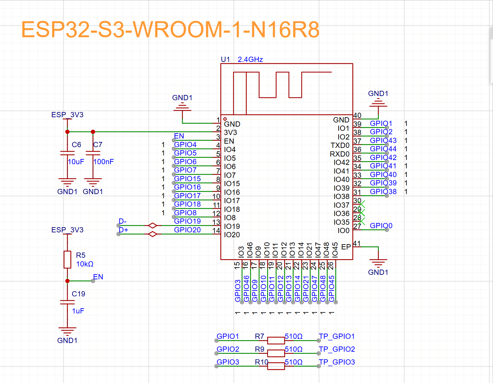

#### 2.2.1 Audio 模块接口说明（ES8311）

​	本项目音频系统由麦克风、音频编解码器（ES8311）和音频功放（NS4150B）组成，整体音频链路采用 I2S 总线进行数据传输，I2C 进行控制通信，配合模拟音频输入输出构建完整的音频采集与播放路径。

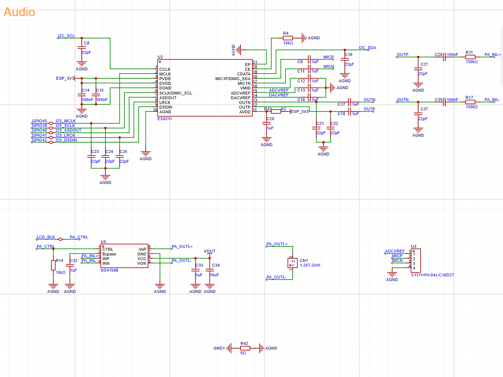

接口资源一览表：

| 模块       | 功能           | 接口类型         | 连接引脚  | 说明                   |
| ---------- | -------------- | ---------------- | --------- | ---------------------- |
| ES8311     | 音频编解码器   | I2S MCLK         | GPIO45    | 主时钟输入             |
|            |                | I2S BCLK（SCLK） | GPIO39    | Bit时钟                |
|            |                | I2S LRCK         | GPIO41    | 左右声道选择           |
|            |                | I2S DSDIN        | GPIO42    | 音频数据输入（ADC）    |
|            |                | I2S ASDOUT       | GPIO40    | 音频数据输出（DAC）    |
|            |                | I2C SCL          | GPIO46    | 控制寄存器通信         |
|            |                | I2C SDA          | GPIO45    | 控制寄存器通信         |
| 麦克风模块 | 模拟麦克风输入 | 模拟差分输入     | MICP/MICN | 连接 ES8311 模拟输入端 |
| NS4150B    | 音频功放       | 模拟差分输入     | INP/INN   | 接收 ES8311 输出信号   |
|            |                | 模拟差分输出     | PA_OUTL±  | 接扬声器输出           |
|            | 控制信号       | GPIO 控制        | CTRL      | 用于功放开关控制       |

#### 2.2.2 Camera模块接口说明

​	摄像头模块使用 DVP 接口，包含并行图像数据、时钟与控制信号；

​	与 ESP32-S3 的 GPIO 资源分配如下：

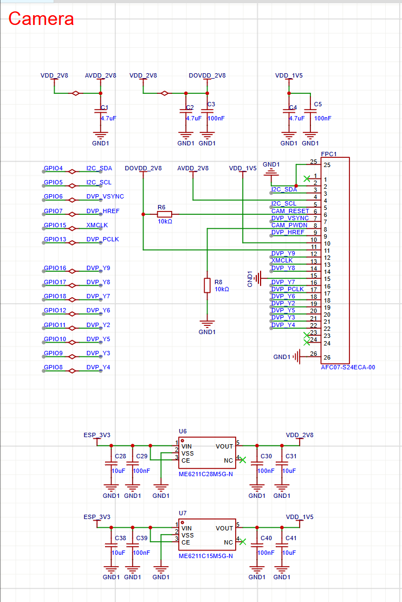

接口资源一览表：

| 信号功能   | ESP32-S3 GPIO | 接口类型 | 说明                   |
| ---------- | ------------- | -------- | ---------------------- |
| I2C_SCL    | GPIO5         | I2C      | 摄像头配置控制时钟     |
| I2C_SDA    | GPIO4         | I2C      | 摄像头配置控制数据线   |
| DVP_VSYNC  | GPIO6         | GPIO     | 帧同步信号             |
| DVP_HREF   | GPIO7         | GPIO     | 行同步信号             |
| DVP_PCLK   | GPIO13        | GPIO     | 像素时钟               |
| DVP_Y[0:9] | GPIO8–GPIO17  | GPIO     | 8-bit 图像并行数据输入 |
| XCLK       | GPIO15        | GPIO     | 外部提供的时钟信号     |

#### 2.2.3 LCD模块接口说明

​	本项目采用一块 1.54 英寸的彩色 LCD 显示屏，使用 **SPI 接口** 与 ESP32-S3 进行通信，并通过 GPIO 控制背光开关和数据命令选择。

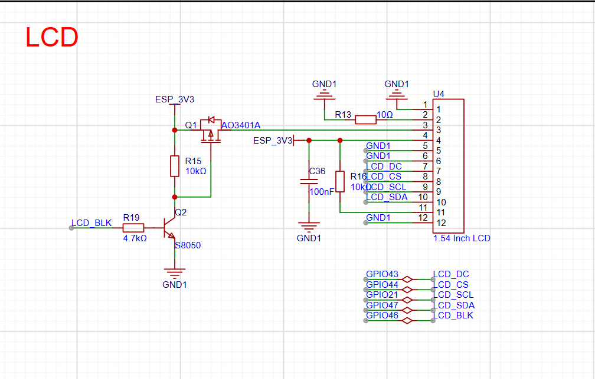

接口资源分配表：

| 信号功能            | ESP32-S3 GPIO | 接口类型 | 说明                       |
| ------------------- | ------------- | -------- | -------------------------- |
| LCD_DC（数据/命令） | GPIO43        | GPIO     | 控制 LCD 数据或命令模式    |
| LCD_CS（片选）      | GPIO44        | SPI      | SPI 芯片片选               |
| LCD_SCL（时钟）     | GPIO21        | SPI      | SPI 通信时钟               |
| LCD_SDA（数据）     | GPIO47        | SPI      | SPI 主输出（MOSI）         |
| LCD_BLK（背光控制） | GPIO46        | GPIO     | 控制晶体管开关驱动背光供电 |

#### 2.2.4 IMU模块接口说明

​	本系统使用 Bosch 的 **BMI270 六轴传感器**（加速度计 + 陀螺仪），通过 I²C 接口连接至 ESP32-S3，用于运动感知与姿态检测。

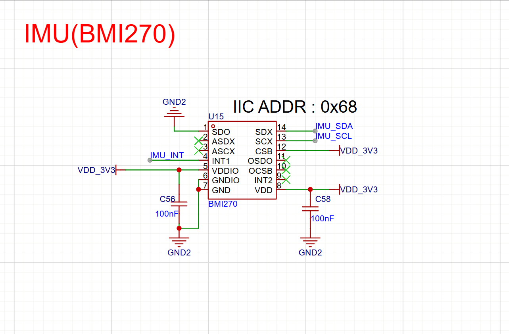

接口资源分配表：

| 信号功能 | ESP32-S3 GPIO          | 接口类型 | 说明                           |
| -------- | ---------------------- | -------- | ------------------------------ |
| IMU_SCL  | 默认引脚（配置中设定） | I²C      | 串行时钟线，用于主从通信同步   |
| IMU_SDA  | 默认引脚（配置中设定） | I²C      | 串行数据线，用于主从数据交换   |
| IMU_INT  | GPIO48                 | GPIO     | 中断输出引脚，用于检测事件触发 |

### 2.3 中断源映射与优先级分配

| 任务名称           | 所属模块         | 相关中断源               | 映射引脚     | NVIC 优先级  | 描述说明                     |
| ------------------ | ---------------- | ------------------------ | ------------ | ------------ | ---------------------------- |
| `capture_image`    | 图像采集模块     | 摄像头帧同步中断 (VSYNC) | `GPIO6`      | 高 (Level 1) | 图像到达时触发帧捕获         |
| `upload_image`     | 图像上传模块     | 无                       | -            | -            | 由图像采集任务或云端解析触发 |
| `parse_cloud_data` | 云端数据解析模块 | UART 接收完成中断        | `UART_RX`    | 中 (Level 2) | 接收云端回应后解析处理       |
| voice_listener     | 语音识别模块     | 无                       |              |              | 收到热词则唤醒               |
| `recognize_speech` | 语音识别模块     | Google 语音云返回事件    | 无本地中断   | -            | 基于事件消息触发             |
| `motor_control`    | UART 通信模块    | UART 接收中断            | `UART_RX`    | 中 (Level 2) | 接收指令后执行动作控制       |
| `display_output`   | LCD 显示模块     | GPIO中断（可选）         | `GPIO43-47`  | 低 (Level 3) | 根据系统状态更新显示         |
| `log_event`        | 本地日志模块     | 定时器中断或任务通知     | TIMx（可选） | 低 (Level 3) | 定时记录或事件驱动           |
| `trigger_listener` | BMI270 触发模块  | GPIO中断（BMI270_INT）   | `GPIOx`      | 中 (Level 2) | IMU 检测到事件时唤醒系统     |

### 2.4 定时器配置与用途说明

​	本系统基于 ESP32 的定时器资源（Timer Group 0 和 Group 1）进行多任务调度控制，满足图像采集、日志记录、云端通讯等周期性任务需求。各定时器按功能分配如下：

#### 2.4.1 定时器资源配置

| 定时器编号 | 所属组  | 频率设置        | 模式     | 中断类型 | 使用状态 |
| ---------- | ------- | --------------- | -------- | -------- | -------- |
| TIMER0     | Group 0 | 1MHz（1μs精度） | 周期性   | 启用     | 已分配   |
| TIMER1     | Group 0 | 1MHz            | 单次触发 | 启用     | 保留备用 |
| TIMER0     | Group 1 | 1MHz            | 周期性   | 启用     | 已分配   |
| TIMER1     | Group 1 | 不使用          | -        | -        | 未分配   |

#### 2.4.2 定时器用途分配

| 定时器      | 用途说明                      | 关联任务                              | 说明                         |
| ----------- | ----------------------------- | ------------------------------------- | ---------------------------- |
| TIMER0 (G0) | 图像采集帧率控制（如 30 FPS） | `capture_image`                       | 控制摄像头采集周期           |
| TIMER1 (G0) | 图像上传控制/心跳延时         | `upload_image`                        | 控制图像上传节奏，防止过频   |
| TIMER0 (G1) | 本地日志记录周期（如每 5s）   | `log_event`                           | 控制日志数据采集与存储周期   |
| 软件定时器  | LCD 刷新 / 云端轮询等周期任务 | `display_output` / `parse_cloud_data` | 基于 FreeRTOS 软件定时器实现 |


## 3 软件架构与任务调度

### 3.1 软件分层结构说明

为提高系统的可维护性、可移植性与模块解耦能力，本项目采用 **面向对象的三层分层架构**，将嵌入式系统的业务逻辑、任务调度与底层硬件驱动有效隔离，形成清晰的责任边界。整体结构分为：

- **App 层（应用业务层）**
- **Middleware 层（中间件逻辑层）**
- **Driver 层（底层驱动层）**

​	并结合统一的任务注册机制与驱动接口抽象机制，形成灵活可扩展的系统基础

#### 3.1.1 软件结构图

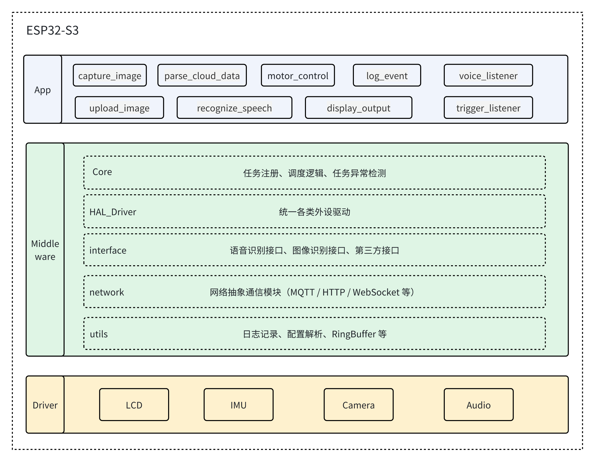

#### 3.1.2 各层职责划分

| 层级          | 说明                                                         |
| ------------- | ------------------------------------------------------------ |
| App 层        | 实现上层业务逻辑，如图像采集、控制指令处理、云端通信等功能。每个功能模块对应一个 RTOS 任务，但**任务的创建由 Middleware 层完成**。 |
| Middleware 层 | 项目核心调度与桥接层，负责所有任务的注册、调度与生命周期管理，封装对底层 Driver 的统一接口，并承担多芯片平台的适配与兼容。 |
| Driver 层     | 负责硬件相关操作的具体实现，如摄像头驱动、串口通信、PWM 控制等。按芯片型号或功能模块进行分类组织，供 Middleware 层统一调用。 |

### 3.2 面向对象的分层设计

#### 3.2.1 分层设计策略

（1） App 层策略

- 每个业务功能独立封装为一个任务类（如图像上传、控制执行）
- 不依赖具体硬件、通信协议
- 示例：`UploaderTask.run()` → 调用 middleware 中的 `Uploader.upload(img)`

（2）Middleware 层策略

- 封装跨模块复杂操作（如图像采集 → 编码 → 上传）
- 使用接口隔离硬件差异与协议细节
- 错误处理、日志、状态跟踪也在此处理
- 目标是实现“平台无关的功能调用”

（3） Driver 层策略

- 仅封装具体平台调用（如 ESP-IDF HAL）
- 每个硬件模块/协议一个 driver 文件
- 更换设备时，只修改该层

#### 3.2.2 任务注册机制与抽象调度接口

**（1）设计原则**

- 职责分离：App 层只负责任务定义与注册，不负责创建任务；
- 集中调度：所有任务由中间件 Core 模块集中调度创建，便于统一管理；
- 接口抽象：所有调度调用封装为抽象接口，便于替换 RTOS 或添加 Hook。

**（2）任务注册机制概述**

整体采用“表驱动 + 集中调度”的方式：

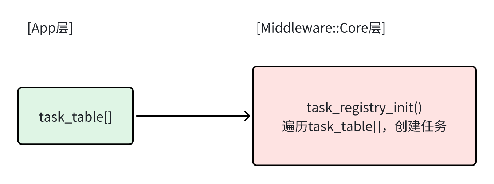

```c
const task_config_t app_tasks[] = {
    { .name = "CameraTask", .entry = camera_task, .stack = 4096, .priority = 5 },
    { .name = "UploadTask", .entry = upload_task, .stack = 4096, .priority = 4 },
    // ... 可扩展更多任务配置
};
```

**（3）任务结构体与注册表定义**

```c
typedef struct {
    const char* task_name;        // 任务名称
    void (*task_entry)(void*);    // 任务入口函数
    uint16_t stack_size;          // 栈大小
    UBaseType_t priority;         // 优先级
} task_entry_t;

// 外部注册数组（由 app 提供）
extern const task_entry_t app_task_table[];
extern const size_t app_task_count;

// 初始化函数（由 Core 调用）
void task_registry_init(void);

```

**（4）调用抽象接口**

```c
// 抽象接口（可封装为函数指针以适配不同系统）
static void default_task_create(const task_entry_t* t) {
    xTaskCreate(t->task_entry, t->task_name, t->stack_size, NULL, t->priority, NULL);
}

// 注册并调度所有任务
void task_registry_init(void) {
    for (size_t i = 0; i < app_task_count; ++i) {
        default_task_create(&app_task_table[i]);
    }
}
```

#### 3.2.3 驱动抽象与统一接口封装

Driver层多芯片支持分目录结构：

```c
drivers/
└── esp32-s3/                  // 针对 ESP32-S3 芯片的所有驱动
    ├── ov2640/               // 摄像头驱动
    ├── esp_uart/             // UART 串口驱动
    ├── mqtt_client/          // MQTT 通信驱动
    ├── mcpwm/                // PWM 电机控制
    └── gpio_expander/        // GPIO 扩展器驱动（如有）
```

### 3.3 任务运行时调度控制

​	本节说明系统在任务完成注册后，运行时如何调度各类任务，确保响应及时、资源高效利用。所有调度行为均依赖 FreeRTOS 核心调度器，结合优先级、事件机制、中断响应等方式进行控制。

#### 3.3.1 任务调度模式选择

**抢占式调度（Preemptive Scheduling）**

- 高优先级任务可随时中断低优先级任务。
- 系统响应速度快，适合实时任务频繁、逻辑复杂的应用。
- ESP32 默认启用此模式，适用于本项目。

#### 3.3.2 任务优先级规划

| 任务名             | 优先级 | 理由                                       |
| ------------------ | ------ | ------------------------------------------ |
| `trigger_listener` | 高     | 中断响应，需快速处理                       |
| voice_listener     | 中高   | 常驻监听热词唤醒，需低延迟识别触发语音通道 |
| `motor_control`    | 中高   | 控制执行，不能卡顿                         |
| `upload_image`     | 中     | 上传过程涉及网络，允许稍微等待             |
| `recognize_speech` | 中     | 用户语音识别，需相对及时                   |
| `display_output`   | 中     | UI反馈适中                                 |
| `log_event`        | 中低   | 日志可延迟写入                             |
| `parse_cloud_data` | 中低   | 上传成功后的回调处理                       |
| `capture_image`    | 低     | 可以缓慢采集                               |

#### 3.3.3 任务调度机制设计

**（1）语音识别功能**

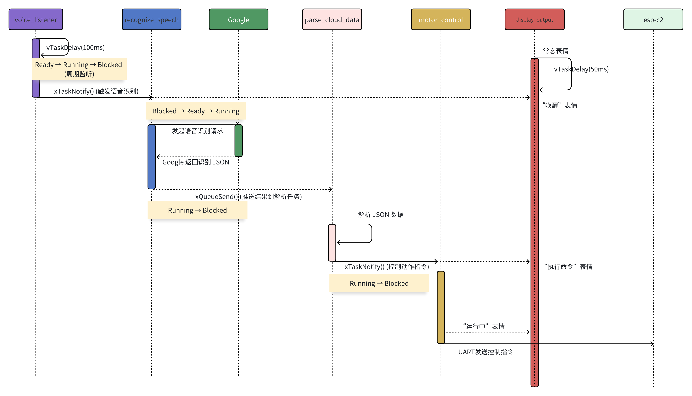

**（2）图像识别功能**

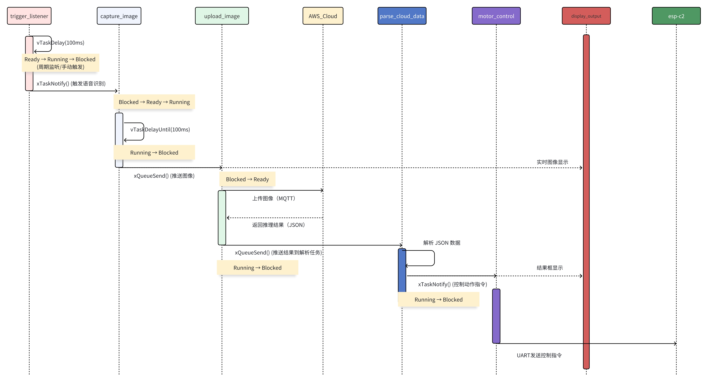

## 4 状态机模型说明

​	本节将对系统中存在状态转移机制的模块进行汇总，统一整理其**状态机模型**，用于指导任务行为管理、界面反馈逻辑与系统调度配合。以下各模块均具备明确的状态切换需求。

### 4.1 display_output 状态机

**作用：** 显示屏任务根据系统所处模式与事件驱动，动态显示表情状态或图像识别内容。

**模式 A：语音控制模式（表情状态机）**

| 状态                | 说明                         | 触发事件                        |
| ------------------- | ---------------------------- | ------------------------------- |
| Idle（常态）        | 显示默认笑脸                 | 无事件，循环显示                |
| Listening（唤醒）   | 显示“唤醒”状态表情           | voice_listener 被唤醒后发出通知 |
| Executing（执行中） | 显示“执行命令”或“运动中”表情 | motor_control 接收到指令后通知  |

**模式 B：图像识别模式（图像显示状态机）**

| 状态         | 说明                    | 触发事件                        |
| ------------ | ----------------------- | ------------------------------- |
| 显示原始图像 | 显示图像帧预览          | capture_image 发出图像帧        |
| 显示识别结果 | 在图像上叠加识别框/标签 | parse_cloud_data 推送 JSON 结果 |

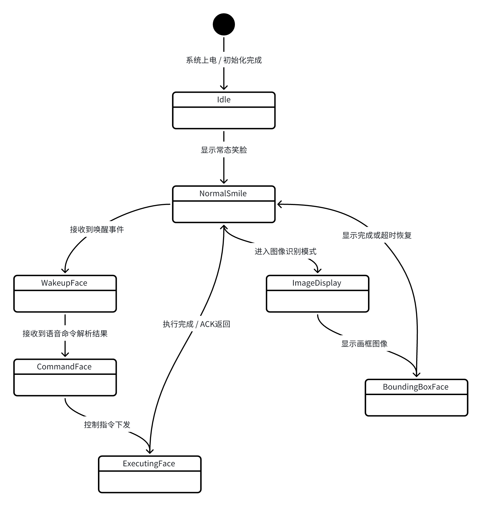

### 4.2 voice_listener 状态机

**作用：** 周期监听是否处于唤醒状态，执行语音唤醒动作。

| 状态    | 说明               | 转移条件           |
| ------- | ------------------ | ------------------ |
| Blocked | 等待周期到达       | vTaskDelay(100ms)  |
| Running | 检查输入、发送通知 | 周期唤醒           |
| Blocked | 再次进入阻塞       | 处理完一次监听逻辑 |

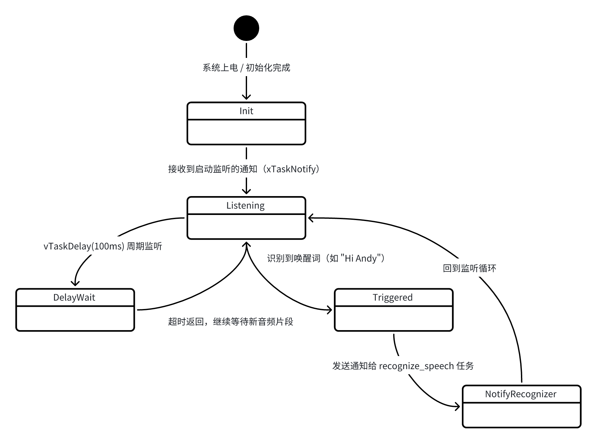

### 4.3 recognize_speech 状态机

**作用：** 等待唤醒信号后启动语音识别，并将结果推送给解析任务。

| 状态    | 说明                   | 转移条件                             |
| ------- | ---------------------- | ------------------------------------ |
| Blocked | 等待触发语音识别       | 来自 voice_listener 的 xTaskNotify() |
| Running | 发起请求，接收 JSON    | 一次识别处理周期                     |
| Blocked | 识别完成，等待下次唤醒 | 推送 JSON 后自行进入阻塞             |

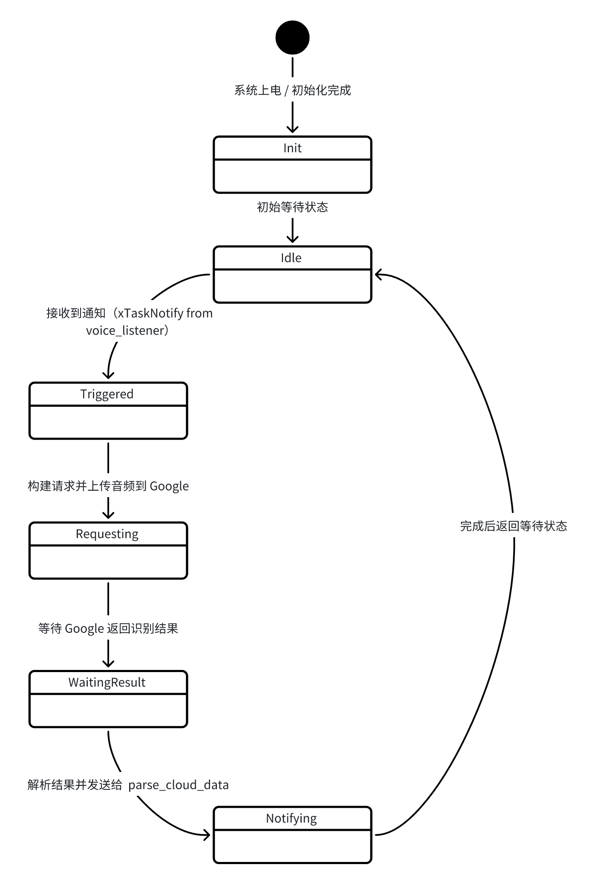

### 4.4 capture_image 状态机

**作用：** 接收 IMU 触发信号后周期采集图像，并将其送入上传任务。

| 状态    | 说明                           | 转移条件             |
| ------- | ------------------------------ | -------------------- |
| Blocked | 等待来自 电容按键 的中断       | xTaskNotifyFromISR() |
| Running | 图像采集 + 发送到 upload_image | 成功采集图像         |
| Blocked | 等待下一帧周期                 | vTaskDelayUntil()    |

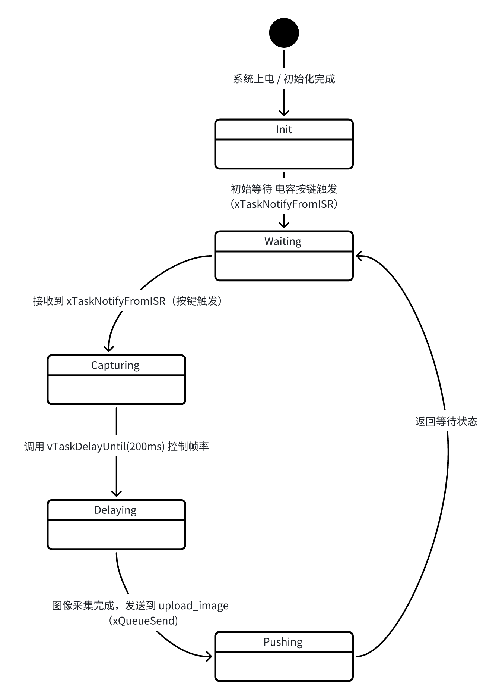

| 状态名    | 描述                                                         |
| --------- | ------------------------------------------------------------ |
| Init      | 初始化状态，设置任务句柄、通知机制，等待 电容按键中断触发    |
| Waiting   | 阻塞等待 按键 触发（通过 `xTaskNotifyFromISR` 唤醒）         |
| Capturing | 调用摄像头驱动采集图像帧，分配缓冲区                         |
| Delaying  | 调用 `vTaskDelayUntil` 控制采集频率，避免频繁触发            |
| Pushing   | 将图像帧发送至 `upload_image` 模块的消息队列（`xQueueSend`） |

### 4.5 parse_cloud_data 状态机

**作用：** 统一接收语音/图像识别 JSON 结果，并分发命令与日志。

| 状态    | 说明                   | 转移条件                              |
| ------- | ---------------------- | ------------------------------------- |
| Blocked | 等待 JSON 数据队列     | 来自 recognize_speech 或 upload_image |
| Running | 判断任务类型并分发通知 | JSON 已解析                           |
| Blocked | 数据分发完成           | 向 motor_control / log_event 通知后   |

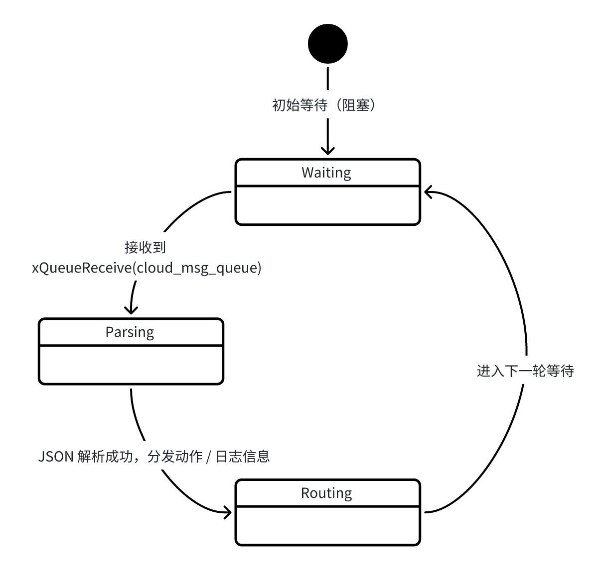

### 4.6 upload_image 状态机

**作用：**

状态机负责将图像上传至云端（AWS IoT Core），为云端识别模块提供数据来源

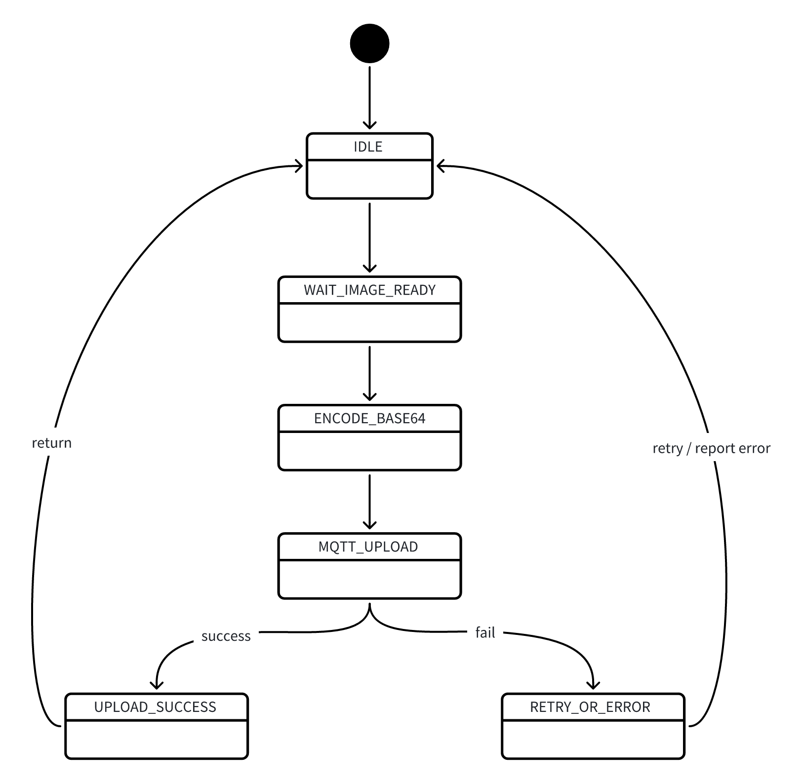

| 状态名           | 描述                                             |
| ---------------- | ------------------------------------------------ |
| IDLE             | 初始空闲态，等待触发上传事件                     |
| WAIT_IMAGE_READY | 检查 `camera_fb_t` 图像帧是否已准备好            |
| ENCODE_BASE64    | 将图像帧内容编码为 Base64 字符串                 |
| MQTT_UPLOAD      | 构造 Payload 并通过 MQTT Client 发布至云端 Topic |
| UPLOAD_SUCCESS   | 上传成功，打印日志并返回上层状态                 |
| RETRY / ERROR    | 上传失败，记录日志，可尝试重传或触发错误处理路径 |

## 5 驱动层设计

​	本节用于说明本项目使用的驱动层设计策略，包括驱动来源、适配方式、封装接口以及与中间件的连接关系，旨在实现模块化、高可维护性与平台适配性。

### 5.1 驱动选型原则

​	驱动模块的选型依据如下三类需求进行决策：

​		**功能需求（F1~F12）：** 明确系统所需硬件功能（如图像采集、语音识别、LCD 显示、音频播放等）

​		**非功能需求（N1~N11）：** 限定性能指标（如延迟、带宽、内存）

​		**系统约束条件（C1~C7）：** 资源限制（CPU、RAM、功耗）、通信限制等

​	驱动选型应优先使用 **ESP-IDF 官方支持或推荐的组件**，并遵循模块化、资源可控、接口统一、可维护的原则。

### 5.2 驱动组件清单与功能映射

| 模块功能              | 驱动组件名称                                            | 功能用途                      | 备注（资源消耗/风险）  |
| --------------------- | ------------------------------------------------------- | ----------------------------- | ---------------------- |
| 图像采集（F1）        | `esp32-camera`                                          | 采集 OV2640 图像帧            | 占用 PSRAM，需带宽保障 |
| 图像上传（F2）        | `esp-http-client` 或 `esp-mqtt`                         | 上传至云端服务器（HTTP/MQTT） | 带宽敏感               |
| 云端推理解析（F3~F4） | —（主控端解析 JSON）                                    | 接收并解析云端 YOLO 结果      | 需支持 HTTP/MQTT 协议  |
| 串口通信（F5~F7）     | ESP-IDF 内建 UART 驱动                                  | 控制信令、调试日志、下发命令  | 需支持 ACK + 超时机制  |
| 语音识别（F8）        | `esp-sr`, `esp-dsp`                                     | 关键词识别、本地命令控制      | 占用 RAM，需模型轻量化 |
| 音频播放（F9）        | `esp-audio-player`, `esp_codec_dev`, `esp-libhelix-mp3` | 播放语音提示与反馈            | 依赖外部编解码芯片     |
| 显示控制（F10~F11）   | `lvgl`, `esp_lvgl_port`                                 | LCD 显示界面、状态表情渲染    | 需配置 SPI 显存        |
| 按键输入（辅助）      | `button`                                                | 启动、重启等物理控制          | 可封装为中断           |
| IMU 检测（F12）       | 自定义 BMI270 驱动封装                                  | 触发唤醒/交互切换             | 需配置 I²C 与中断      |

### 5.3 驱动层封装与中间层接口策略

​	为了统一驱动调用方式、提升可维护性，驱动模块不直接暴露给应用层，而是通过 `middle/hal_*.c` 接口中转，形成三层结构：

```txt
App 层（状态机/任务） → Middle 层（HAL 抽象接口） → Driver 层（驱动实现/ESP组件）
```

- Middle 层封装所有 `esp-*` 驱动 API

- 支持 mock 替换、测试替换、版本升级透明化

- 具体模块如 `hal_camera.c`, `hal_audio.c`, `hal_display.c` 已根据组件命名一一对应

