# 系统模块设计

​	本章从上层与下层子系统两个维度，详细说明各功能模块的职责、调度方式、通信逻辑和关键算法流程，明确软硬件协同的具体实现机制。包括云服务器模块（AWS）的模块设计。

## 1 上层子系统功能模块（ESP32-S3）

### 1.1 功能概览

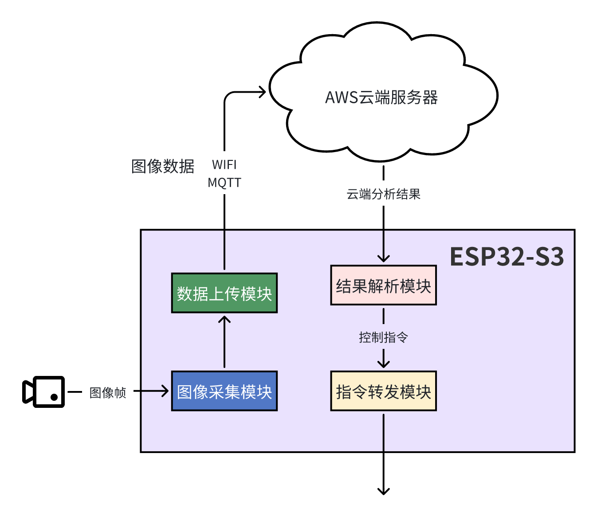

- **图像采集模块**：通过 OV2640 摄像头获取图像帧。
- **数据上传模块**：将图像数据发送至云端服务器（支持 UART/Wi-Fi MQTT/HTTP）。

- **结果解析模块**：接收云端返回的检测结果（目标类别、方向等）。

- **指令转发模块**：将结果转换为控制指令，通过 UART 下发至 ESP32-C2。

### 1.2 时间调度机制设计

#### 1.2.1 任务设计

（1）调度方式

​	基于 FreeRTOS 的抢占式多任务调度；

（2）任务划分与优先级

| 任务名                  | 优先级 | 周期/触发方式        | 说明                           |
| ----------------------- | ------ | -------------------- | ------------------------------ |
| `camera_task`           | 中     | 周期定时触发         | 图像采集任务，约每 200ms 一帧  |
| `image_upload_task`     | 高     | 事件驱动（图像可用） | 上传图像至云端，支持失败重传   |
| `result_parse_task`     | 高     | 事件驱动（返回结果） | 接收云端推理结果并提取控制信息 |
| `motor_control_tx_task` | 中低   | 事件驱动（指令就绪） | 将控制指令发送至下层 ESP32-C2  |

- `camera_task` 通过定时器驱动，作为系统起点；

- `image_upload_task` 在图像缓冲队列有新图像时启动，优先级高，确保实时上传；

- `result_parse_task` 等待推理结果返回后立即处理，优先级同样高；

- `motor_control_tx_task` 根据解析后的结果再封装并发送控制命令，优先级可略低以避免抢占上传/解析过程。

（3）通信机制

​	使用 FreeRTOS 队列 / 信号量 / 事件组协调任务执行；

（4）超时处理

​	上传失败后退避重传，指令执行超时警告等机制预留。

#### 1.2.2 任务调度时序图

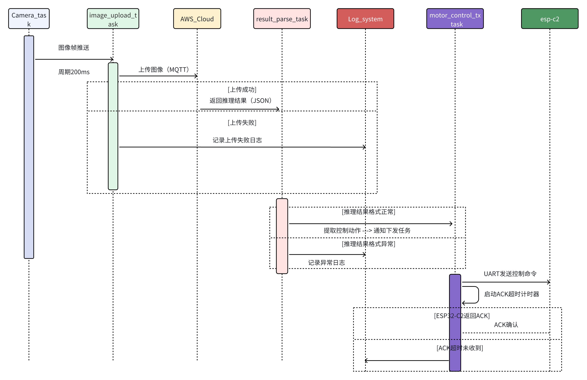

**任务调度与反馈流程说明**

​	为满足系统响应及时性与可靠性需求，本系统基于 FreeRTOS 构建四大核心任务，并设计完整的任务调度与反馈机制。图 x 展示了图像采集至控制指令下发的完整时序路径：

- **图像采集任务 camera_task**：以 200ms 为周期进行图像采集，并将图像帧通过信号量通知上传任务；

- **图像上传任务 image_upload_task**：负责将图像上传至 AWS 云端，若上传失败则进行最多三次重试，并通过 `log_system` 输出日志；

- **推理结果解析任务 result_parse_task**：接收云端返回的 JSON 结果，若结构合法则提取动作信息，并通知控制任务；若格式异常则记录错误日志；

- **控制指令下发任务 motor_control_tx_task**：负责封装控制指令通过 UART 发送至下层 ESP32-C2，同时启动超时定时器监听 ACK；

- **ACK 机制**：若在规定时间内接收到 ACK，则流程结束；否则记录“控制失败”日志，提示系统调试或下层异常。

​	本设计实现了从图像采集 → 云端推理 → 指令下发 → 控制反馈 的**闭环控制链条**，满足项目中“响应时间 ≤ 400ms”、“上传/控制任务具备容错机制”的核心要求。

### 1.3 空间域内存与资源管理

#### 1.3.1 任务资源分配设计

| 任务名                  | 栈大小（字） | 栈大小（字节） | 缓冲资源                                        | 缓冲用途说明                       |
| ----------------------- | ------------ | -------------- | ----------------------------------------------- | ---------------------------------- |
| `camera_task`           | 768 words    | 3 KB           | 使用 DMA 双缓冲区（PSRAM 中每帧图像 ~60 KB）    | 摄像头帧采集，每 200ms 推送一次    |
| `image_upload_task`     | 1536 words   | 6 KB           | 图像上传缓冲区（64 KB PSRAM），状态码标志字节   | 支持 MQTT/HTTP 上行，失败重传机制  |
| `result_parse_task`     | 1024 words   | 4 KB           | 推理结果缓存（4 KB），控制结构体缓冲（512 B）   | 解析 JSON 格式结果，提取控制动作   |
| `motor_control_tx_task` | 768 words    | 3 KB           | 控制命令缓冲区（512 B），ACK 等待记录区（1 KB） | 处理 UART 指令下发，ACK 超时计时   |
| `log_system`            | 512 words    | 2 KB           | 环形日志缓存区（2~4 KB）                        | 记录失败上传、异常 JSON 等调试信息 |

#### 1.3.2 系统内存计算

| 模块         | 占用内存             | 说明                                           |
| ------------ | -------------------- | ---------------------------------------------- |
| 图像缓冲     | ~128 KB（2帧双缓冲） | 驱动层采集原始 YUV/RGB 数据，保存在 PSRAM      |
| 上传缓冲     | ~64 KB               | 与上传任务绑定，支持失败重传机制               |
| 任务栈总占用 | ~18 KB（任务栈）     | 5个主要任务，栈空间分配如上                    |
| JSON 缓冲区  | ~4 KB                | 用于临时存储推理返回值，result_parse_task 使用 |
| 控制命令缓存 | ~1 KB                | motor_control_tx_task 用于 UART ACK 管理       |
| 日志缓存     | ~4 KB                | 仅调试版本开启，可关闭以节省资源               |

#### 1.3.3 任务栈监控机制

​	为保障系统稳定性，所有任务启动后将周期性检测栈水位，避免溢出风险：

```c
// FreeRTOS 任务中使用
UBaseType_t stack_left = uxTaskGetStackHighWaterMark(NULL);
if (stack_left < 100) {
    ESP_LOGW("STACK", "Task %s nearing overflow: %d words left", pcTaskGetName(NULL), stack_left);
}
```

​	在调试版本中，配合 `vTaskList()` 或 ESP-IDF 的 CLI 工具 `esp_timer_dump()` 可输出所有任务运行状态、CPU 占用、剩余堆栈空间等。

#### 1.3.4 异常处理与资源保护

| 异常情形          | 处理机制                                                     |
| ----------------- | ------------------------------------------------------------ |
| 栈溢出            | 注册 FreeRTOS 钩子函数 `vApplicationStackOverflowHook()` 打印任务名并重启系统 |
| 上传失败          | 记录日志 → 指定次数后丢弃 / 重传                             |
| JSON 异常         | result_parse_task 记录异常 → 进入 fallback 状态              |
| 控制命令 ACK 超时 | 自动触发 resend，3 次失败后上报 Log                          |

#### 1.3.5 空间管理设计总结图

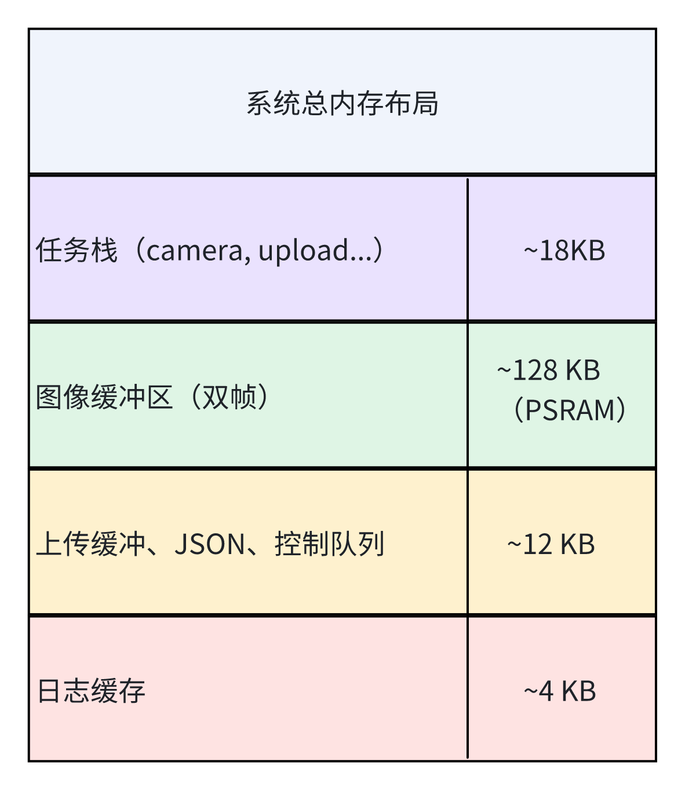

### 1.4 代码结构设计（面向对象分层架构）

​	为了增强系统的模块化、可维护性与可扩展性，本项目采用标准的 **三层面向对象架构**，将上层控制逻辑、设备驱动与中间适配逻辑进行**解耦封装**，并构建清晰的接口与职责边界。整体代码结构如下图所示：

#### 1.4.1 分层结构说明

| 层级              | 功能职责                           | 模块示例                                      | 对上提供           | 对下依赖                 |
| ----------------- | ---------------------------------- | --------------------------------------------- | ------------------ | ------------------------ |
| **App 层**        | 实现系统的功能业务逻辑与调度       | `camera_task`、`upload_task`、`motor_tx_task` | UI或用户逻辑       | Middleware接口           |
| **Middleware 层** | 封装通信、日志、解析等通用服务模块 | `cloud_comm`、`result_parser`、`log_system`   | App层任务          | Driver层接口             |
| **Driver 层**     | 控制底层硬件寄存器或调用 HAL SDK   | `camera_driver`、`uart_driver`                | Middleware底层控制 | ESP-IDF SDK / 硬件寄存器 |

#### 1.4.2 代码结构设计示意图

（1）代码目录初步设计

```text
project_root/
├── app/
│   ├── camera_task.cpp         # 摄像头采集任务
│   ├── upload_task.cpp         # 图像上传任务
│   └── command_task.cpp        # 控制命令处理任务

├── middleware/
│   ├── uploader.cpp            # 图像上传中间封装模块（MQTT/HTTP）
│   ├── json_parser.cpp         # 结果解析与封装模块
│   └── motor_encoder.cpp       # 控制指令编码器（封装驱动调用）

├── drivers/
│   ├── ov2640_driver.c         # OV2640 摄像头底层驱动
│   ├── uart_driver.c           # UART 通信驱动
│   └── mqtt_client.c           # MQTT 通信驱动模块
```

（2）UML包含关系示意图

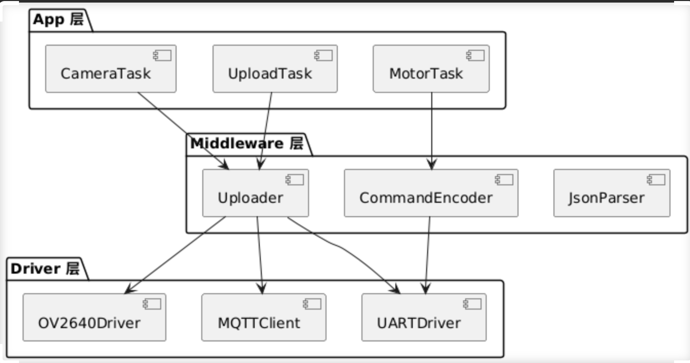

#### 1.4.3代码结构设计策略

（1） App 层策略

- 每个业务功能独立封装为一个任务类（如图像上传、控制执行）
- 不依赖具体硬件、通信协议
- 示例：`UploaderTask.run()` → 调用 middleware 中的 `Uploader.upload(img)`

（2）Middleware 层策略

- 封装跨模块复杂操作（如图像采集 → 编码 → 上传）
- 使用接口隔离硬件差异与协议细节
- 错误处理、日志、状态跟踪也在此处理
- 目标是实现“平台无关的功能调用”

（3） Driver 层策略

- 仅封装具体平台调用（如 ESP-IDF HAL）
- 每个硬件模块/协议一个 driver 文件
- 更换设备时，只修改该层

## 2 下层子系统功能模块（ESP32-C2）

### 2.1 功能概览

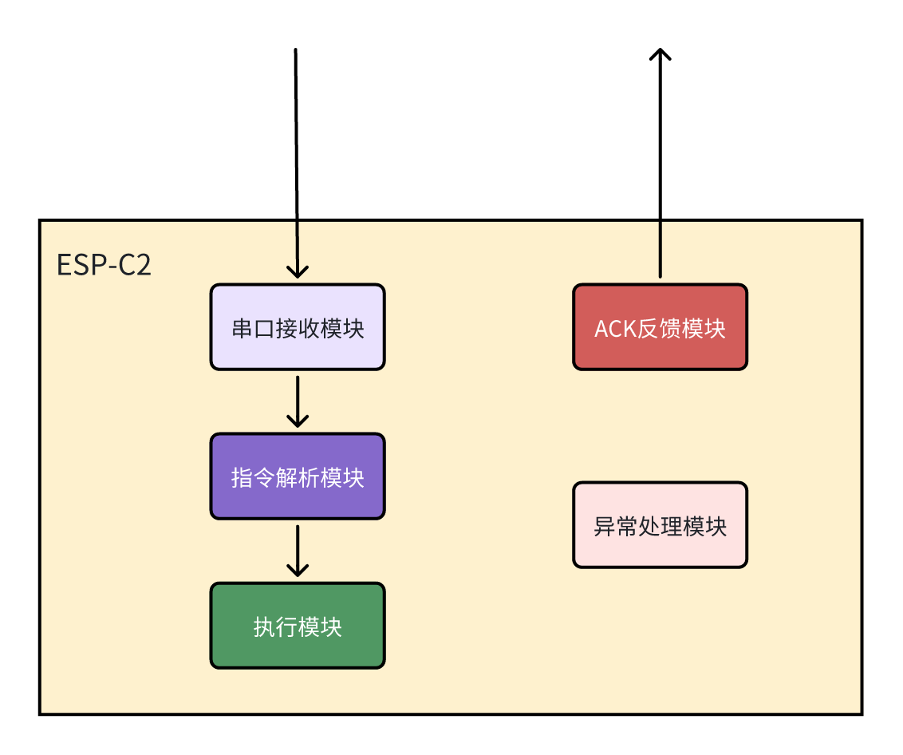

- 串口接收模块：接收来自 ESP32-S3 的控制指令（通常为 JSON 格式），UART 驱动支持

- 指令解析模块：解析接收到的控制命令，提取操作内容（如“转动”“停止”等），含校验与合法性判断，确保执行安全

- 执行模块：将解析出的命令映射到具体硬件操作，如电机控制、GPIO 输出

- ACK 反馈模块：对每条指令响应 ACK，确认执行状态（成功 / 超时 / 错误），定时触发或中断驱动，提升通讯可靠性

- 异常处理模块：处理如命令非法、执行失败、硬件响应超时等异常，提供 fail-safe 策略，可重发或记录错误码

### 2.2 时间调度机制设计

#### 2.2.1 任务划分与说明

| 任务名             | 优先级 | 调度方式      | 功能说明                                       |
| ------------------ | ------ | ------------- | ---------------------------------------------- |
| uart_rx_task       | 高     | 事件驱动      | 监听串口接收缓冲区，接收控制指令               |
| command_parse_task | 中     | 事件驱动      | 解析收到的 JSON 控制命令，提取控制指令内容     |
| exec_task          | 中     | 事件驱动      | 执行相应动作，如 GPIO 输出或 PWM 控制电机      |
| ack_task           | 中     | 定时/事件驱动 | 发送 ACK 消息，反馈执行状态                    |
| fault_handler_task | 中低   | 异常触发      | 监控硬件异常或指令格式错误，执行容错或保护动作 |

#### 2.2.2 任务调度时序图

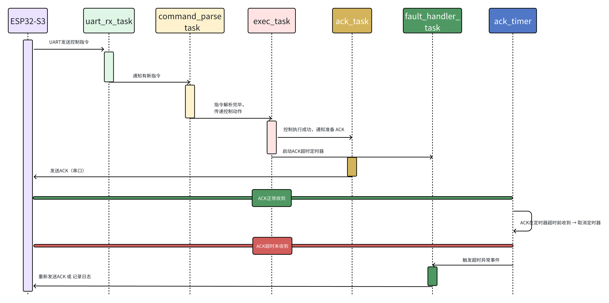

**任务调度与反馈流程说明**

- **uart_rx_task**：负责通过 UART 接收来自 ESP32-S3 的控制指令，并将原始数据传递给解析任务。

- **command_parse_task**：对指令进行语义解析，提取目标动作，并通知执行任务处理。

- **exec_task**：依据解析结果进行控制动作执行，并在完成后通知 ACK 任务发送确认。

- **ack_task**：执行 ACK 反馈的准备和发送，并启动超时检测定时器。

- **ack_timer**：作为软件定时器用于检测 ACK 是否在规定时间内收到反馈结果，若超时未收到将通知异常处理。

- **fault_handler_task**：负责处理 ACK 超时事件，可选择重新发送 ACK 或记录日志/触发恢复策略。

**两种反馈情况：**

- ✅ **正常：ESP32-S3 在规定时间内返回“ACK已收到”，则定时器任务被中止。**
- ❌ **异常：若超时未收到 ACK 反馈，则 `ack_timer` 触发超时事件，通知 `fault_handler_task` 执行相应处理（记录日志或重发ACK）。**

### 2.3 空间域内存与资源管理

#### 2.3.1 任务资源分配设计

| 任务名称             | 栈大小（words） | 栈大小（bytes） | 说明                                    |
| -------------------- | --------------- | --------------- | --------------------------------------- |
| `uart_rx_task`       | 1024            | 4096            | 串口接收任务，需留足中断缓冲            |
| `command_parse_task` | 1024            | 4096            | 包含字符串处理、参数判断、JSON 解析逻辑 |
| `exec_task`          | 768             | 3072            | 控制逻辑不复杂，但不能中断过久          |
| `ack_task`           | 512             | 2048            | 及时响应，延迟容忍度低                  |
| `ack_timer`          | 512             | 2048            | 定时精度要求高，使用软件定时器栈        |
| `fault_handler_task` | 512             | 2048            | 异常处理任务，一般空闲运行              |

#### 2.3.2 系统内存计算

| 项目                         | 使用情况（估算） |
| ---------------------------- | ---------------- |
| 可用 RAM                     | ~272 KB          |
| 固定开销（启动区、堆、系统） | ~64 KB           |
| 总任务栈空间                 | ~6 KB            |
| 剩余堆空间                   | ~200 KB+         |

#### 2.3.3 任务栈监控机制

为保障系统稳定性，所有任务启动后将周期性检测栈水位，避免溢出风险：

```c
// FreeRTOS 任务中使用
UBaseType_t stack_left = uxTaskGetStackHighWaterMark(NULL);
if (stack_left < 100) {
    ESP_LOGW("STACK", "Task %s nearing overflow: %d words left", pcTaskGetName(NULL), stack_left);
}
```

​	在调试版本中，配合 `vTaskList()` 或 ESP-IDF 的 CLI 工具 `esp_timer_dump()` 可输出所有任务运行状态、CPU 占用、剩余堆栈空间等。

#### 2.3.4 异常处理与资源保护

- 超时未收到 ACK → 触发 `fault_handler_task`，记录异常，避免 ACK 队列溢出

- 若检测到任务空闲栈过低，可主动 `restart()` 重启（开发版阶段）

- 某些模块可设计为 *watchdog-safe*，即加入 `esp_task_wdt_add()` 强制监控

#### 2.3.5 空间管理设计总结构图

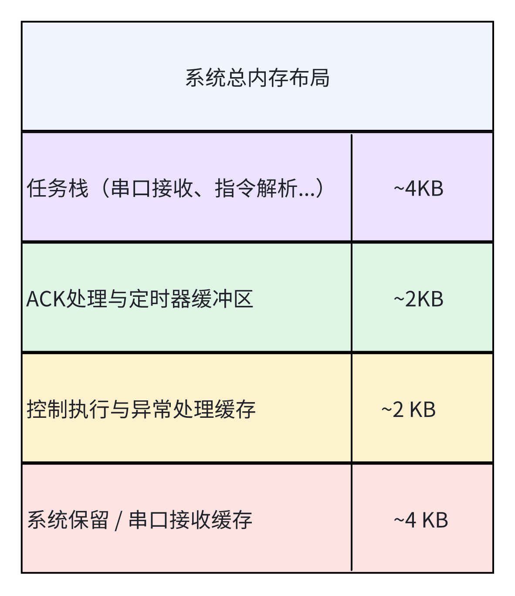

### 2.4 代码结构设计

#### 2.4.1 代码目录初步设计

```plaintext
project_root/
├── main/
│   ├── main.c                    // 应用入口，任务注册与初始化
│   ├── uart_comm.c/.h           // 串口收发模块（含中断处理、缓冲机制）
│   ├── command_parser.c/.h      // 指令解析模块（命令拆解、参数识别）
│   ├── exec_task.c/.h           // 控制执行模块（如控制电机、触发动作）
│   ├── ack_manager.c/.h         // ACK 反馈 + 超时机制（含软件定时器）
│   ├── fault_handler.c/.h       // 异常监测与容错处理
│   └── system_config.h          // 优先级、栈大小、日志等级等参数配置
├── CMakeLists.txt               // 构建入口
└── sdkconfig                    // menuconfig 生成配置
```

#### 2.4.2 UML包含关系示意图

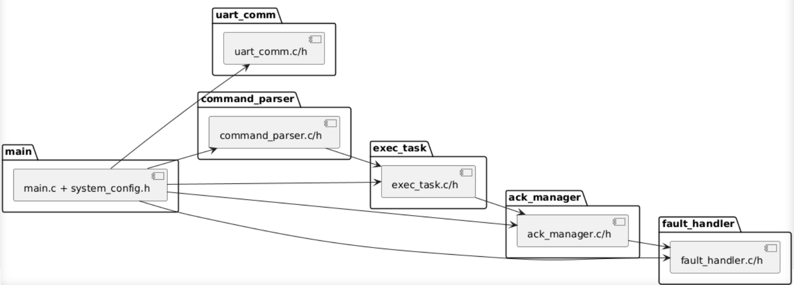


## 3 云端服务器模块（AWS）

### 3.1 功能概览

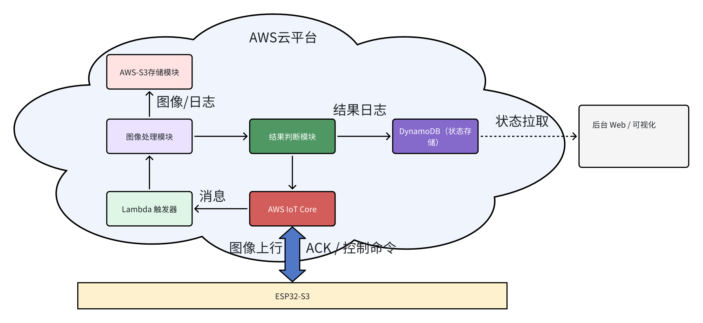

- **ESP32-S3** : 捕获图像并通过 MQTT 上行发送至 AWS IoT Core
- **AWS IoT Core** : 提供 MQTT 通信接口，ESP32-S3 向其上传图像、接收 ACK。

- **Lambda 触发器** : 接收 MQTT 消息并触发图像处理或逻辑判断，可实现无服务器架构。
- **图像处理模块** : 对上传图像进行处理（如人脸检测/事件判断），可集成 Sagemaker 或调用模型接口。
- **结果判断模块** : 根据图像或指令内容判断控制逻辑，生成反馈消息。 
- **DynamoDB 状态存储** : 保存判断结果与历史状态，供 Web 端查询。
- **Web 可视化平台**：展示结果状态，辅助调试与远程监控。
- **ACK / 控制反馈** : 将执行结果封装成 MQTT 消息，发送给终端设备。

### 3.2 技术栈与部署方案

#### 3.2.1 技术栈总览

- **基础通信通路**

| 阶段目标                                 | 技术组件 / 服务                                              | 说明                                                    |
| ---------------------------------------- | ------------------------------------------------------------ | ------------------------------------------------------- |
| 建立终端图像上传、云端接收与反馈回传通路 | 🔹 ESP32-S3（摄像采集、MQTT上传） <br />🔹 MQTT over TLS<br />🔹 AWS IoT Core<br />🔹 AWS Lambda（触发器） | 建立图像上行链路和基本控制下行链路，先实现端-云交互闭环 |

- **图像识别与逻辑判断**

| 阶段目标                                     | 技术组件 / 服务                                              | 说明                                                         |
| -------------------------------------------- | ------------------------------------------------------------ | ------------------------------------------------------------ |
| 添加图像处理与判断流程，具备初步智能分析能力 | 🔹 Lambda 图像处理逻辑（Python）<br />🔹 可选集成 AWS SageMaker<br />🔹 AWS-S3 存图模块<br />🔹 结果判断模块（本地逻辑或模型） | 图像处理/推理过程可写在 Lambda 内部，支持模型调用或自定义逻辑 |

- **状态记录与可视化拓展**

| 阶段目标                                  | 技术组件 / 服务                                              | 说明                                                    |
| ----------------------------------------- | ------------------------------------------------------------ | ------------------------------------------------------- |
| 增加状态持久化、后台控制和 Web 可视化支持 | 🔹 AWS DynamoDB（状态/记录）<br />🔹 Web 可视化前端 + REST API（可选）<br />🔹 AWS API Gateway（可选）<br />🔹 权限控制：IAM + IoT Policy | 实现多端信息同步、Web控制与可追溯分析，便于后期迭代扩展 |

#### 3.2.2 技术架构分阶段说明

- **基础通信通路构建**

（1）阶段目标

​	建立从边缘设备（ESP32-S3）到云端（AWS IoT）的稳定图像上传链路，确保摄像头图像能够成功采集、封装、上传并由云端服务接收与处理，为后续控制逻辑与推理系统奠定通信基础。

（2）系统组成与任务划分

| 功能模块   | 所属平台     | 关键任务        | 作用说明                               |
| ---------- | ------------ | --------------- | -------------------------------------- |
| 摄像头采集 | ESP32-S3     | `camera_task`   | 周期性采集图像（JPEG）                 |
| 数据封装   | ESP32-S3     | `uploader_task` | 将图像转换为 base64，并封装为 JSON     |
| 消息上传   | ESP32-S3     | `mqtt_client`   | 通过 MQTT over TLS 上传至 AWS IoT Core |
| 云端入口   | AWS IoT Core | 规则引擎        | 将 MQTT 消息触发转发至 Lambda          |
| 数据接收   | AWS Lambda   | 处理函数        | 解析 JSON，并记录或写入 S3（可选）     |

（3）系统时序图

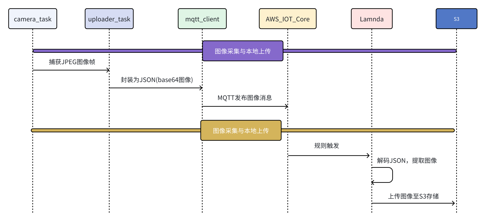

​	图像采集任务从 camera_task 启动，经过 uploader_task 编码后通过 mqtt_client 向 AWS IoT Core 发送 MQTT 消息，触发 Lambda 函数，解析图像数据并可选上传至 S3，实现从终端到云端的基础通信路径构建。

- **图像识别与逻辑判断**

（1）阶段目标

​	在完成图像采集与上传的基础上，进一步构建图像识别能力与逻辑判断机制。通过 AWS Lambda 或 SageMaker 模型分析图像内容，并根据识别结果做出智能判断，为后续控制与状态记录打下基础。

（2）系统组成与任务划分

| 功能模块         | 所属平台               | 关键任务           | 作用说明                                           |
| ---------------- | ---------------------- | ------------------ | -------------------------------------------------- |
| 图像解析         | AWS Lambda             | 图像解码模块       | 解码 base64 图像，并准备输入模型                   |
| 图像识别推理     | AWS Lambda / SageMaker | 推理服务调用模块   | 调用训练好的图像识别模型，进行目标检测或分类       |
| 逻辑判断         | AWS Lambda             | 规则引擎或判断模块 | 根据识别结果进行逻辑判断，生成下一步处理指令或标记 |
| 回传机制（可选） | AWS Lambda → ESP32-S3  | MQTT Client        | 将判断结果封装为响应消息，通过 MQTT 发送回边缘设备 |

（3）系统时序图

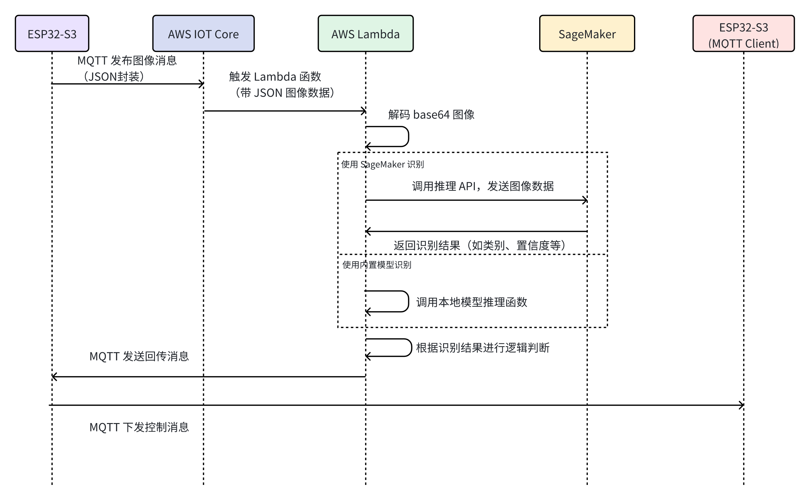

​	阶段二通过 AWS Lambda 对上传图像进行智能识别与逻辑判断，必要时将结果回传至边缘设备，实现云端决策与本地响应的闭环控制。

- **状态记录与可视化拓展**

（1）阶段目标

​	建立云端状态记录与可视化能力，实现图像识别结果与系统状态的持久化存储、查询与展示，为后续扩展监控平台与用户交互界面奠定基础。

（2）系统组成与任务划分

| 功能模块         | 所属平台            | 关键任务           | 作用说明                                             |
| ---------------- | ------------------- | ------------------ | ---------------------------------------------------- |
| 图像识别结果处理 | AWS Lambda          | 逻辑判断           | 提取识别结果，并结构化为状态记录项                   |
| 状态存储         | AWS DynamoDB        | 数据写入           | 将结构化结果写入云端 NoSQL 数据库                    |
| 可视化平台       | Web 前端 + REST API | 前端展示，API 查询 | 展示识别记录、状态变化等信息，支持多维数据筛选与访问 |
| 权限控制         | AWS IAM/IoT Policy  | 身份验证与访问控制 | 管理前端访问权限与 API 使用策略                      |

（3）系统时序图

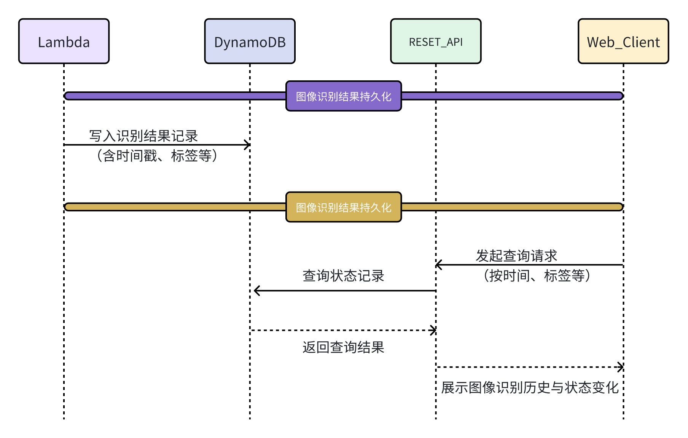

​	基于前一阶段的图像识别结果，完成系统状态的结构化处理、云端存储和可视化展示。通过将识别信息上传至 AWS DynamoDB 进行状态记录，并结合可选的 Web 前端与 REST API 接口，实现系统运行状态的远程监控与人机交互能力的拓展，为后续功能升级和业务集成打下基础。


