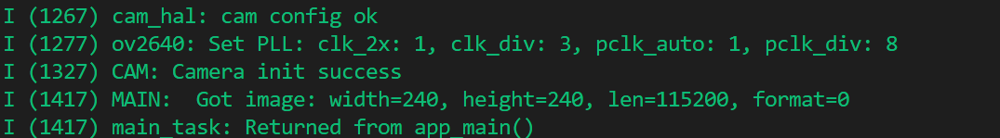

# ESP32-S3代码设计

## 1 文档说明

### 1.1 编写目的

​	本文件旨在对 ESP32-S3 多任务智能控制项目的各个软件模块进行代码级详细设计说明，明确模块职责、调用接口、状态管理与实现逻辑，为后续编码、调试与维护提供参考依据。

### 1.2 文档版本控制

| 版本号 | 修订日期   | 作者 | 修改内容说明                                   | 审核人     | 备注 |
| ------ | ---------- | ---- | ---------------------------------------------- | ---------- | ---- |
| V1.0   | 2025/07/13 | Andy | 初版草案，建立整体目录结构及第一批模块设计说明 | （待填写） |      |
|        |            |      |                                                |            |      |
|        |            |      |                                                |            |      |
|        |            |      |                                                |            |      |
|        |            |      |                                                |            |      |
|        |            |      |                                                |            |      |

## 2 项目总体代码结构

```txt
project_root/
├── App/                        # 应用层（项目功能任务）
│   ├── voice_listener/         # 语音触发规则识别
│   ├── capture_image/          # 图像采集任务
│   ├── upload_image/           # 图像上传任务
│   ├── parse_cloud_data/       # 云返回数据解析
│   ├── motor_control/          # 车辆操控任务
│   ├── display_output/         # 表情/界面显示
│   └── log_event/              # 日志记录任务
│
├── Middleware/                # 中间件层（模型分组、通信封装等）
│   ├── core/                   # 系统启动、main.c 、调度初始化
│   ├── message/                # 通信组件封装 (Queue/Notify/Event)
│   ├── model/                  # AI 模型调用逻辑 (语音/图像/云)
│   └── utils/                  # 公共工具函数和定义
│
├── Driver/                    # 驱动层（硬件驱动和平台实现）
│   ├── esp32s3/                # ESP32-S3 实现相关 (包括 LCD / UART / SPI 等)
│   └── bmi270/                 # BMI270 IMU 驱动实现
```

## 3 应用层代码设计说明

### 3.1 目录结构总览


## 4 中间件层代码设计说明

​	ESP32-S3 中间件层（Middleware）是系统功能协同的核心，负责统一调度、驱动封装与应用接口暴露，具备良好的扩展性与模块解耦能力。

### 4.1 目录结构总览

```txt
middleware/                         # 中间件层
    ├── core/                           # 调度核心模块
    │   ├── task_manager.c              # 任务注册与状态管理
    │   ├── task_scheduler.c            # 调度逻辑与优先级控制
    │   ├── task_monitor.c              # 异常任务监测
    │   
    │
    ├── HAL_Driver/                     # 外设驱动统一抽象
    │   ├── hal_camera.c                # 摄像头抽象驱动
    │   ├── hal_audio.c                 # 音频采集驱动封装
    │   ├── hal_display.c               # 显示驱动抽象
    │   └── hal_gpio.c                  # GPIO 驱动抽象
    │
    ├── interface/                      # 外部识别功能接口封装
    │   ├── interface_speech.c          # 语音识别服务调用接口
    │   ├── interface_image.c           # 图像识别接口
    │   └── interface_third_party.c     # 云平台等第三方接口封装
    │
    ├── network/                        # 网络抽象与通信模块
    │   ├── mqtt_client.c               # MQTT 客户端封装
    │   ├── http_client.c               # HTTP 上传与下载接口
    │   └── websocket_client.c          # WebSocket 支持（如启用）
    │
    └── utils/                          # 工具类封装模块
        ├── log_system.c                # 日志系统
        ├── config_parser.c             # 配置文件解析
        ├── ringbuffer.c                # RingBuffer 缓冲区实现
        └── helper.c                    # 通用辅助函数库
```

### 4.2 Core模块代码设计

#### 4.2.1 模块整体功能概述（Core 核心模块）

Core 模块位于中间件层（`middleware/core/`），是系统调度与任务生命周期管理的核心。其职责包括：

（1）集中任务注册与调度初始化

- Core 模块**不定义任务**，而是通过统一接口 `task_registry_init()`，**接收 App 层注册的任务表 `task_table[]`**；
- 所有任务创建统一在 Core 层完成，实现职责分离与集中调度管理。

（2）提供任务调度与优先级控制逻辑

- 内部根据任务优先级，在初始化时进行注册与分组；
- 可扩展调度策略，如任务预启动、任务延后、任务组管理等；
- 所有调度逻辑集中在 `task_scheduler.c`，避免任务启动分散不一致。

（3）异常任务监控与运行时检查机制

- Core 层提供基础任务监控模块（`task_monitor.c`），可统计运行时异常，如任务丢失、运行超时、CPU 占用异常等；
- 预留 WatchDog / Hook 接入点，增强系统稳定性与可追溯性。

（4）任务创建抽象接口

- 提供 `default_task_create()` 封装接口，统一所有任务的创建流程，**便于后续切换 RTOS、替换任务创建 API 或加入系统监控逻辑**；
- App 层与任务创建机制完全解耦。

（5）与 App 层接口约定

- App 层仅需在 `app_task_table[]` 中注册任务元信息（函数名、栈、优先级）；
- Core 层遍历注册表自动创建任务，避免重复编码。

#### 4.2.2 task_manager.c(任务注册机制)代码设计

（1）任务结构体定义

​	定义统一的任务描述结构 `task_entry_t`，由 App 层通过数组注册，便于 Core 层集中管理：

```c
typedef struct {
    const char* task_name;                // 任务名称
    void (*task_entry)(void*);           // 任务入口函数
    uint16_t stack_size;                 // 栈大小
    UBaseType_t priority;                // 优先级
} task_entry_t;
```


（2）任务注册表声明

​	App 层在 `main/` 下提供任务注册表:

```c
extern const task_entry_t app_task_table[];
extern const size_t app_task_count;
```

（3）注册入口函数：`task_registry_init()`

```c
void task_registry_init(void) {
    for (size_t i = 0; i < app_task_count; ++i) {
        default_task_create(&app_task_table[i]);
    }
}
```

（4）任务创建抽象接口：`default_task_create()`

​	该接口为任务创建封装了 FreeRTOS 的 `xTaskCreate` 调用：

```c
static void default_task_create(const task_entry_t* t) {
    xTaskCreate(t->task_entry, t->task_name, t->stack_size, NULL, t->priority, NULL);
}
```


## 5 驱动层与Hal_driver代码设计说明

### 5.1 驱动组件清单与功能对照表

| 编号 | 所属模块     | 使用组件名称                        | 组件来源（ESP-IDF）    | 功能用途                       | 是否需封装 HAL 接口 |
| ---- | ------------ | ----------------------------------- | ---------------------- | ------------------------------ | ------------------- |
| D1   | 摄像头模块   | `esp32-camera`                      | ESP-IDF 官方组件       | 图像采集，支持 OV2640          | 是                  |
| D2   | 语音识别模块 | `esp-sr`、`esp-dsp`                 | ESP-IDF 官方组件       | 关键词识别、语音前处理         | 是                  |
| D3   | 音频播放模块 | `esp-audio-player`                  | 第三方组件（chmorgan） | 播放提示音/语音反馈            | 是                  |
| D4   | 音频播放模块 | `esp_codec_dev`、`esp-libhelix-mp3` | ESP-IDF 官方+第三方    | 音频解码与播放（如MP3）        | 是                  |
| D5   | 显示模块     | `lvgl`、`esp_lvgl_port`             | 第三方 + ESP移植封装   | 渲染情绪面板和交互界面         | 是                  |
| D6   | 按键模块     | `button`                            | ESP-IDF 官方组件       | 手动控制、重启、触发模式切换等 | 是                  |
| D7   | 网络通信模块 | `esp-mqtt`、`esp-http-client`       | ESP-IDF 官方组件       | 云端通信上传图像与接收推理结果 | 否（直接使用）      |

### 5.2 驱动层与hal_driver组件汇总

#### 5.2.1 驱动模块汇总表

| 模块编号 | 驱动模块功能            | 使用组件（ESP-IDF）                                 | HAL 层主要接口函数                                           | 推荐源文件命名    |
| -------- | ----------------------- | --------------------------------------------------- | ------------------------------------------------------------ | ----------------- |
| D1       | 摄像头图像采集          | `esp32-camera`                                      | `hal_camera_init()``hal_camera_capture()`                    | `hal_camera.c/h`  |
| D2       | 本地语音识别            | `esp-sr`, `esp-dsp`                                 | `hal_voice_init()``hal_voice_get_command()`                  | `hal_voice.c/h`   |
| D3       | 音频播放反馈            | `esp-audio-player``esp_codec_dev``esp-libhelix-mp3` | `hal_audio_init()``hal_audio_play(file)`                     | `hal_audio.c/h`   |
| D4       | 显示模块（表情 / 状态） | `lvgl`, `esp_lvgl_port`                             | `hal_display_init()``hal_display_show_emotion()`             | `hal_display.c/h` |
| D5       | 本地按钮输入            | `button`                                            | `hal_button_init()``hal_button_read()``hal_button_register_callback()` | `hal_button.c/h`  |
| D6       | 网络通信模块            | `esp-mqtt`, `esp-http-client`（二选一）             | `hal_network_init()``hal_network_upload_image()``hal_network_recv_command()` | `hal_network.c/h` |
| D7       | BMI270 传感器（触发）   | 用户移植 or `esp-i2c`, `bmi270`第三方组件           | `hal_motion_init()``hal_motion_detect()`                     | `hal_motion.c/h`  |

#### 5.2.2 组件获取代码设计

​	ESP-IDF v5+ 推荐通过 `idf_component.yml` + `idf.py add-dependency` 命令进行依赖管理，所有组件将统一下载至 `managed_components/` 目录，避免本地污染、版本冲突。

**`idf_component.yml`（项目根目录）**:

```c 
version: "1.0.0"
description: "ESP32-S3 智能语音+图像项目组件依赖配置"

dependencies:
  espressif/esp32-camera: "*"
  espressif/esp-sr: "*"
  espressif/esp-dsp: "*"
  espressif/esp-audio-player: "*"
  espressif/esp-libhelix: "*"
  espressif/esp_codec_dev: "*"
  lvgl/lvgl: "*"
  espressif/esp_lvgl_port: "*"
  espressif/button: "*"
  espressif/esp-mqtt: "*"
  espressif/esp-http-client: "*"  # 若需要 HTTP 上传
```

### 5.3 各功能代码设计

#### 5.3.1 camera功能代码设计

​	`camera_hal` 模块封装了 ESP32 官方摄像头驱动 `esp_camera`，提供统一的初始化、反初始化和图像采集接口，简化主业务逻辑调用，屏蔽底层硬件细节。支持初始化配置结构体、图像翻转控制、图像帧获取等功能。

**(1) 初始化流程**

```txt
camera_hal_init()
├── i2c_hal_init()               // 初始化 I2C 接口
├── 填充 camera_config_t 结构体
├── 打印 GPIO、格式配置日志
├── esp_camera_init(&config)     // 调用官方 API 初始化摄像头
└── sensor 参数调整（翻转/镜像）
```

**(2)主要函数和结构体说明**

| 函数名                                  | 功能                                          | 参数 | 返回值                            |
| --------------------------------------- | --------------------------------------------- | ---- | --------------------------------- |
| `esp_err_t camera_hal_init(void)`       | 初始化摄像头模块，包括 I2C 和 sensor 参数配置 | 无   | 成功返回 `ESP_OK`，失败返回错误码 |
| `esp_err_t camera_hal_deinit(void)`     | 反初始化摄像头模块，释放资源                  | 无   | ESP 错误码                        |
| `camera_fb_t* camera_hal_capture(void)` | 采集一帧图像帧并返回指针                      | 无   | 图像帧指针（失败返回 NULL）       |

**(3) 输出数据格式**



```txt
MAIN: Got image: width=240, height=240, len=115200, format=0
CAM: Camera init success
```


#### 5.3.2 

